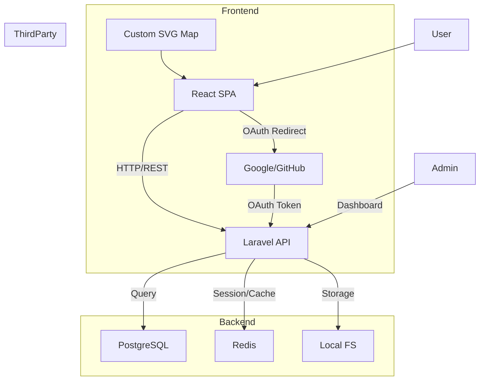
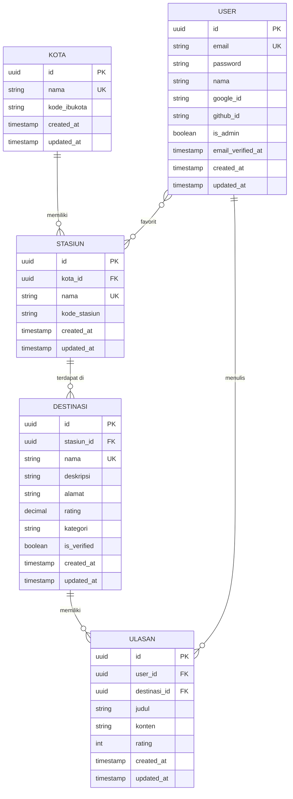

# JejakJalur — AI Developer Context

> Generated by MAGI · 19 Mei 2026
> Paste sebagai context ke AI coding assistant (Cursor, Copilot, Claude, dll).
> Docs included: SDD, SRS, PRD, PLAN, RISK, BRD, CRITIC, CHARTER

---

## Project Overview

**Nama Project:** JejakJalur

**Seed Idea:**
Aplikasi web direktori pariwisata dan kuliner hidden gem yang dirancang khusus untuk pelancong jalur darat berbasis rute stasiun kereta api (fokus awal rute: Jakarta, Bandung, Yogyakarta, Surabaya).

Target User: Backpacker dan pelancong yang transit atau baru tiba di stasiun dan mencari rekomendasi tempat makan atau wisata terdekat.

Fitur Wajib (Core):

Front-end: Antarmuka interaktif dengan navigasi berbasis peta rute/timeline stasiun. Desain harus custom dari nol (dilarang menggunakan template).

Back-end / Dashboard Admin: Panel khusus admin untuk mengelola seluruh data platform.

CRUDS Wajib: >    - Create, Read, Update, Delete untuk entri Stasiun, Kota, dan Destinasi (oleh Admin).

User terdaftar bisa Create (menulis) dan Read (membaca) Review/Ulasan.

Fitur Search untuk mencari destinasi berdasarkan stasiun terdekat.

Authentication: Login, Register, Logout konvensional.

Integrasi Ekstra: Login menggunakan pihak ketiga (Google API / Github API).

Tech Stack Constraint: Web akan dibangun menggunakan kombinasi React/Svelte untuk front-end dan Laravel/Node.js untuk back-end. Arsitektur database relasional harus dirancang serapi mungkin untuk menghubungkan entitas Kota, Stasiun, Destinasi, User, dan Ulasan.

---

## SDD — Software Design Document

# SDD: JejakJalur

## TL;DR
JejakJalur adalah aplikasi web direktori pariwisata/kuliner *hidden gem* yang berfokus pada **rute stasiun kereta api** di 4 kota (Jakarta, Bandung, Yogyakarta, Surabaya). Arsitektur **monolith** dengan **React (FE) + Laravel (BE) + PostgreSQL** dipilih karena:
- **Skala MVP kecil** (10–50 concurrent users, 40 destinasi, 120 ulasan dummy) → Monolith cukup efisien, menghindari over-engineering.
- **Tech stack constraint** dari user: FE (React/Svelte), BE (Laravel/Node.js). Kami pilih **React + Laravel** karena:
  - Laravel punya **Eloquent ORM** (ideal untuk integritas relasi Kota→Stasiun→Destinasi→User→Ulasan) + **built-in auth** (OAuth, session).
  - React + library SVG (e.g., `react-svg` atau `d3.js`) memungkinkan **custom subway-map UI** tanpa template.
  - **Database PostgreSQL** (bukan MySQL) karena:
    - `pg_trgm` untuk *fuzzy search* (misal: pencarian "warung kopi" di dekat Stasiun Gambir).
    - **Fitur advanced**: `GIN` index untuk performa pencarian.
    - **Ekstensibilitas**: PostgreSQL mendukung ekstensi seperti `PostGIS` (jika nanti perlu fitur geospasial).
- **Deployment** ke **VPS (DigitalOcean/Droplet)** dengan **Nginx + Docker** (untuk konsistensi environment) + **GitHub Actions** (CI/CD).
- **Security**: OAuth 2.0 (Google/GitHub), AES-256 encryption (untuk PII), HTTPS-only, dan **UU PDP compliance** (right to be forgotten, consent management).

---

## 1. System Architecture

### Style: Monolith
- **Reasoning**:
  - Skala MVP **tidak memerlukan microservices** (overhead komunikasi > manfaat).
  - **Laravel** sudah mendukung modularitas internal (e.g., `app/ModulesAdmin`, `app/ModulesAPI`).
  - **Shared database** (PostgreSQL) optimal untuk integritas relasi antar entitas (Kota, Stasiun, Destinasi, User, Ulasan).
  - **Cost-effective**: Monolith pada VPS (1 Droplet, ~$20/bulan) mencukupi untuk 50 concurrent users.

### High-Level Component Diagram


### Komunikasi Antar Komponen
| Komponen | Protokol | Contoh |
|----------|----------|--------|
| FE → BE | HTTP/REST (JSON) | `GET /api/stasiun/{id}/destinasi` |
| BE → DB | PostgreSQL (TCP) | Port `5432` (localhost) |
| BE → Cache | Redis (TCP) | Port `6379` (localhost) |
| BE → OAuth | HTTPS | `https://accounts.google.com/o/oauth2/auth` |
| FE → User | WebSocket (Opsional) | TODO: butuh klarifikasi — Apakah real-time update ulasan diperlukan? |

---

## 2. Technology Stack

| Layer | Pilihan | Reasoning | Alternatif Ditolak |
|-------------|------------------|-----------|---------------------|
| **Frontend** | React 18 + TypeScript | - **SVG manipulation** mudah (library `react-svg`, `d3.js`).<br>- **State management**: `zustand` (ringan untuk skala MVP).<br>- **UI Framework**: `Tailwind CSS` (custom design, anti-template). | Svelte: Kurang ekosistem untuk SVG custom. |
| **Backend** | Laravel 10 (PHP 8.2) | - **Eloquent ORM**: Relasi Kota→Stasiun→Destinasi→Ulasan terkelola otomatis.<br>- **Auth**: Built-in `laravel/sanctum` (API token) + `laravel/socialite` (OAuth).<br>- **Validation**: `laravel/validator` untuk input sanitization.<br>- **Queue**: `laravel/queue` (Redis) untuk background job (misal: cleanup data). | Node.js: Memerlukan setup manual untuk auth/OAuth (passport.js). |
| **Database** | PostgreSQL 15 | - **`pg_trgm`**: *Fuzzy search* (e.g., pencarian "kafe" → mencari "kedai kopi").<br>- **Index**: `GIN` untuk `pg_trgm`.<br>- **Foreign Key**: Menjamin integritas relasi Kota→Stasiun→Destinasi→User→Ulasan.<br>- **Constraint**: `ON DELETE CASCADE` untuk menghapus data terkait (e.g., hapus Kota → hapus Stasiun dan Destinasi di kota tersebut). | MySQL: Tidak punya `jsonb` (hanya `JSON` dengan performa lebih rendah) dan kurang mendukung *fuzzy search* secara native. |
| **Cache** | Redis 7 | - **Session storage**: Mengurangi beban DB.<br>- **Rate limiting**: Lindungi endpoint `/api/search`. | Memcached: Tidak support data structure (e.g., sets untuk tag destinasi). |
| **Storage** | Local Filesystem | - **Foto destinasi/ulasan**: Disimpan di `/storage/app/public` (Laravel).<br>- **SVG path**: Disimpan sebagai file statis di `/storage/app/public/svg`.<br>- **Backup**: Cron job harian ke S3 (opsional). | S3: Overkill untuk skala MVP (biaya + kompleksitas). |
| **Infra** | VPS (DigitalOcean) | - **1 Droplet** (2 vCPU, 4GB RAM, 80GB SSD) → Cukup untuk 50 concurrent users.<br>- **Docker**: Containerize Laravel + PostgreSQL + Redis. | AWS/GCP: Terlalu mahal untuk prototipe. |
| **CI/CD** | GitHub Actions | - **Workflow**: Push ke `main` → Run test → Build Docker image → Deploy ke VPS. | GitLab CI: Memerlukan setup runner sendiri. |
| **Monitoring** | Prometheus + Grafana | - **Metrics**: Request latency, DB query time, error rate.<br>- **Logging**: Laravel Telescope (dev) + `rsyslog` (prod). | ELK Stack: Overkill untuk skala MVP. |

---
## 3. Database Schema (ERD)

### Justifikasi Pemilihan PostgreSQL
PostgreSQL dipilih karena:
1. **Dukungan `pg_trgm`**: Memungkinkan *fuzzy search* (e.g., pencarian "warung" akan mencari "Warung Mba Iyah" atau "Kedai Kopi Warung").
2. **Integritas Relasional**: Foreign key dan constraint (e.g., `ON DELETE CASCADE`) menjamin konsistensi data antar tabel (Kota→Stasiun→Destinasi→User→Ulasan).
3. **Index Fleksibel**: `GIN` index untuk `pg_trgm` meningkatkan performa pencarian.
4. **Ekstensibilitas**: Mendukung ekstensi tambahan (e.g., `PostGIS`) jika dibutuhkan fitur geospasial di masa depan.



### Indexing Strategy
| Tabel | Kolom | Type Index | Reasoning |
|-------------|---------------------|------------|-----------|
| `KOTA` | `nama` | B-tree (UK) | Cepat untuk pencarian kota. |
| `STASIUN` | `kota_id` | B-tree | Filter stasiun per kota. |
| `STASIUN` | `nama` | B-tree (UK) | Cepat untuk pencarian stasiun. |
| `DESTINASI` | `stasiun_id` | B-tree | Filter destinasi per stasiun. |
| `DESTINASI` | `nama` | GIN (`pg_trgm`) | *Fuzzy search* (e.g., "warung" → "Warung Mba Iyah"). |
| `DESTINASI` | `kategori` | B-tree | Filter destinasi per kategori (e.g., "Kuliner"). |
| `ULASAN` | `destinasi_id` | B-tree | Load ulasan per destinasi. |
| `ULASAN` | `user_id` | B-tree | Load ulasan per user. |
| `USER` | `email` | B-tree (UK) | Cepat untuk login. |
| `USER` | `google_id`, `github_id` | B-tree | OAuth lookup. |

### Constraint dan Foreign Key
- **KOTA → STASIUN**: `STASIUN.kota_id` (FK) → `KOTA.id` dengan `ON DELETE CASCADE` (jika kota dihapus, semua stasiun di kota tersebut ikut terhapus).
- **STASIUN → DESTINASI**: `DESTINASI.stasiun_id` (FK) → `STASIUN.id` dengan `ON DELETE CASCADE` (jika stasiun dihapus, semua destinasi di stasiun tersebut ikut terhapus).
- **USER → ULASAN**: `ULASAN.user_id` (FK) → `USER.id` dengan `ON DELETE CASCADE` (jika user dihapus, semua ulasannya ikut terhapus).
- **DESTINASI → ULASAN**: `ULASAN.destinasi_id` (FK) → `DESTINASI.id` dengan `ON DELETE CASCADE` (jika destinasi dihapus, semua ulasannya ikut terhapus).
- **Unique Constraint**:
  - `KOTA.nama` (UK): Tidak ada kota dengan nama duplikat.
  - `STASIUN.nama` (UK per `kota_id`): Tidak ada stasiun dengan nama duplikat dalam satu kota.
  - `DESTINASI.nama` (UK per `stasiun_id`): Tidak ada destinasi dengan nama duplikat dalam satu stasiun.
  - `USER.email` (UK): Tidak ada user dengan email duplikat.

---
## 4. API Design

### OpenAPI 3.1 Contract
```yaml
openapi: 3.1.0
info:
  title: JejakJalur API
  version: 1.0.0
  description: |
    API untuk aplikasi JejakJalur.
    Autentikasi: Bearer Token (Sanctum) + OAuth (Google/GitHub).
servers:
  - url: https://api.jejakjalur.id/v1
  - url: http://localhost:8000/api/v1
paths:
  # Auth
  /auth/register:
    post:
      summary: Register user baru
      requestBody:
        required: true
        content:
          application/json:
            schema:
              type: object
              required: [nama, email, password]
              properties:
                nama: { type: string, example: "John Doe" }
                email: { type: string, format: email, example: "john@example.com" }
                password: { type: string, format: password, minLength: 8, example: "rahasia123" }
      responses:
        '201':
          description: User berhasil terdaftar
          content:
            application/json:
              schema:
                type: object
                properties:
                  user: { $ref: '#/components/schemas/User' }
                  token: { type: string, example: "1|abc123..." }
        '422':
          description: Validasi gagal (e.g., email sudah terdaftar)

  /auth/login:
    post:
      summary: Login user
      requestBody:
        required: true
        content:
          application/json:
            schema:
              type: object
              required: [email, password]
              properties:
                email: { type: string, format: email }
                password: { type: string, format: password }
      responses:
        '200':
          description: Login berhasil
          content:
            application/json:
              schema:
                type: object
                properties:
                  user: { $ref: '#/components/schemas/User' }
                  token: { type: string }
        '401':
          description: Kredensial salah

  /auth/google:
    get:
      summary: Redirect ke Google OAuth
      description: |
        Redirect user ke halaman consent Google.
        Callback URL: `/auth/google/callback`
      responses:
        '302':
          description: Redirect ke Google

  /auth/google/callback:
    get:
      summary: Handle Google OAuth callback
      parameters:
        - name: code
          in: query
          required: true
          schema: { type: string }
      responses:
        '302':
          description: Redirect ke FE dengan token
        '400':
          description: OAuth gagal

  # Kota (Admin Only)
  /kota:
    get:
      summary: Daftar semua kota
      responses:
        '200':
          description: List kota
          content:
            application/json:
              schema:
                type: array
                items: { $ref: '#/components/schemas/Kota' }
    post:
      summary: Buat kota baru (Admin)
      security: [{ bearerAuth: [] }]
      requestBody:
        required: true
        content:
          application/json:
            schema: { $ref: '#/components/schemas/KotaInput' }
      responses:
        '201':
          description: Kota berhasil dibuat
          content:
            application/json:
              schema: { $ref: '#/components/schemas/Kota' }
        '403':
          description: Tidak punya hak admin

  /kota/{kota_id}:
    get:
      summary: Detail kota
      parameters:
        - $ref: '#/components/parameters/kota_id'
      responses:
        '200':
          description: Detail kota
          content:
            application/json:
              schema: { $ref: '#/components/schemas/Kota' }
        '404':
          description: Kota tidak ditemukan
    put:
      summary: Update kota (Admin)
      security: [{ bearerAuth: [] }]
      parameters:
        - $ref: '#/components/parameters/kota_id'
      requestBody:
        required: true
        content:
          application/json:
            schema: { $ref: '#/components/schemas/KotaInput' }
      responses:
        '200':
          description: Kota berhasil diupdate
        '403':
          description: Tidak punya hak admin
    delete:
      summary: Hapus kota (Admin)
      security: [{ bearerAuth: [] }]
      parameters:
        - $ref: '#/components/parameters/kota_id'
      responses:
        '204':
          description: Kota berhasil dihapus
        '403':
          description: Tidak punya hak admin

  # Stasiun
  /stasiun:
    get:
      summary: Daftar stasiun (dapat difilter per kota)
      parameters:
        - name: kota_id
          in: query
          schema: { type: string, format: uuid }
      responses:
        '200':
          description: List stasiun
          content:
            application/json:
              schema:
                type: array
                items: { $ref: '#/components/schemas/Stasiun' }

  # Destinasi
  /destinasi:
    get:
      summary: Daftar destinasi (dapat difilter per stasiun/kota)
      parameters:
        - name: stasiun_id
          in: query
          schema: { type: string, format: uuid }
        - name: kota_id
          in: query
          schema: { type: string, format: uuid }
        - name: search
          in: query
          schema: { type: string }
          description: Pencarian fuzzy di nama/deskripsi destinasi
      responses:
        '200':
          description: List destinasi
          content:
            application/json:
              schema:
                type: array
                items: { $ref: '#/components/schemas/Destinasi' }

  /destinasi/{destinasi_id}:
    get:
      summary: Detail destinasi + ulasan
      parameters:
        - name: destinasi_id
          in: path
          required: true
          schema: { type: string, format: uuid }
      responses:
        '200':
          description: Detail destinasi
          content:
            application/json:
              schema:
                allOf:
                  - $ref: '#/components/schemas/Destinasi'
                  - type: object
                    properties:
                      ulasan:
                        { type: array, items: { $ref: '#/components/schemas/Ulasan' } }

  # Ulasan (User)
  /ulasan:
    post:
      summary: Buat ulasan baru
      security: [{ bearerAuth: [] }]
      requestBody:
        required: true
        content:
          application/json:
            schema:
              type: object
              required: [destinasi_id, rating, konten]
              properties:
                destinasi_id: { type: string, format: uuid }
                rating: { type: integer, minimum: 1, maximum: 5 }
                judul: { type: string }
                konten: { type: string }
      responses:
        '201':
          description: Ulasan berhasil dibuat
          content:
            application/json:
              schema: { $ref: '#/components/schemas/Ulasan' }
        '403':
          description: Tidak terautentikasi

  /ulasan/{ulasan_id}:
    delete:
      summary: Hapus ulasan (User pemilik)
      security: [{ bearerAuth: [] }]
      parameters:
        - name: ulasan_id
          in: path
          required: true
          schema: { type: string, format: uuid }
      responses:
        '204':
          description: Ulasan berhasil dihapus
        '403':
          description: Bukan pemilik ulasan

components:
  securitySchemes:
    bearerAuth:
      type: http
      scheme: bearer
      bearerFormat: JWT
  parameters:
    kota_id:
      name: kota_id
      in: path
      required: true
      schema: { type: string, format: uuid }
  schemas:
    Kota:
      type: object
      properties:
        id: { type: string, format: uuid }
        nama: { type: string, example: "Jakarta" }
        kode_ibukota: { type: string, example: "JK" }
        created_at: { type: string, format: date-time }
        updated_at: { type: string, format: date-time }
    KotaInput:
      type: object
      required: [nama]
      properties:
        nama: { type: string }
        kode_ibukota: { type: string }
    Stasiun:
      type: object
      properties:
        id: { type: string, format: uuid }
        kota_id: { type: string, format: uuid }
        nama: { type: string, example: "Stasiun Gambir" }
        kode_stasiun: { type: string, example: "GMR" }
        created_at: { type: string, format: date-time }
    Destinasi:
      type: object
      properties:
        id: { type: string, format: uuid }
        stasiun_id: { type: string, format: uuid }
        nama: { type: string, example: "Warung Kopi Mba Iyah" }
        deskripsi: { type: string }
        alamat: { type: string }
        rating: { type: number, example: 4.5 }
        kategori: { type: string, example: "Kuliner" }
        is_verified: { type: boolean }
        created_at: { type: string, format: date-time }
    User:
      type: object
      properties:
        id: { type: string, format: uuid }
        nama: { type: string }
        email: { type: string, format: email }
        is_admin: { type: boolean }
        created_at: { type: string, format: date-time }
    Ulasan:
      type: object
      properties:
        id: { type: string, format: uuid }
        user_id: { type: string, format: uuid }
        destinasi_id: { type: string, format: uuid }
        judul: { type: string }
        konten: { type: string }
        rating: { type: integer, minimum: 1, maximum: 5 }
        user: { $ref: '#/components/schemas/User' }
        created_at: { type: string, format: date-time }
```

### Non-HTTP Endpoints
- **WebSocket**: Tidak diperlukan untuk MVP (real-time update ulasan bisa menggunakan **polling** atau **Server-Sent Events** jika dibutuhkan nanti).
- **Webhook**: Tidak diperlukan untuk MVP.

---
## 5. Deployment & Infrastructure

### Cloud Target: VPS (DigitalOcean)
- **Alasan**:
  - **Biaya**: ~$20/bulan (cukup untuk prototipe).
  - **Kontrol penuh**: Tidak terbatas fitur (seperti AWS Free Tier).
  - **Lokasi server**: Pilih **Singapore (SGP1)** untuk latency rendah ke Indonesia.

### CI/CD Flow
```mermaid
flowchart LR
A[GitHub\n(main branch)] -->|Push| B[GitHub Actions]
B -->|Run Test| C[PHPUnit, Jest]
C -->|Build Image| D[Docker Build]
D -->|Deploy| E[VPS\n(DigitalOcean Droplet)]
E -->|Verify| F[Smoke Test\n/health]
```

### Environment Strategy
| Environment | Domain | Database | Cache | Notes |
|-------------|--------|----------|-------|-------|
| **Development** | `localhost` | PostgreSQL (Docker) | Redis (Docker) | - |
| **Staging** | `staging.jejakjalur.id` | PostgreSQL (Docker) | Redis (Docker) | Mirror dari prod, untuk testing. |
| **Production** | `jejakjalur.id` | PostgreSQL | Redis | - **Backup**: Otomatis (harian) ke `pg_dump`.<br>- **HTTPS**: Certbot (Let’s Encrypt). |

### Observability
| Tool | Purpose | Setup |
|------|---------|-------|
| **Laravel Telescope** | Debugging (dev) | Built-in Laravel, enable di `.env`. |
| **Prometheus + Grafana** | Metrics | Docker container di VPS, scrape Laravel `/metrics`. |
| **rsyslog** | Logging | Simpan log Laravel (`storage/logs`) ke `/var/log/jejakjalur`. |
| **Sentry** | Error Tracking | Integrasi dengan Laravel (`sentry/sentry-laravel`). |

### Docker Setup (Contoh `docker-compose.yml`)
```yaml
version: '3.8'
services:
  app:
    build:
      context: .
      dockerfile: Dockerfile
    ports:
      - "8000:80"
    volumes:
      - ./storage:/var/www/storage
    depends_on:
      - db
      - redis
    environment:
      - DB_HOST=db
      - DB_DATABASE=jejakjalur
      - DB_USERNAME=postgres
      - DB_PASSWORD=secret
      - REDIS_HOST=redis

  db:
    image: postgres:15
    environment:
      - POSTGRES_DB=jejakjalur
      - POSTGRES_PASSWORD=secret
    volumes:
      - postgres_data:/var/lib/postgresql/data

  redis:
    image: redis:7
    volumes:
      - redis_data:/data

  nginx:
    image: nginx:alpine
    ports:
      - "80:80"
    volumes:
      - ./nginx.conf:/etc/nginx/conf.d/default.conf
    depends_on:
      - app

volumes:
  postgres_data:
  redis_data:
```

---
## 6. Security Design

### Mapping NFR Security ke Implementasi
| NFR | Implementasi | Detail |
|-----|--------------|--------|
| **OAuth 2.0** | Laravel Socialite | - Integrasi Google/GitHub OAuth.<br>- Simpan `google_id`/`github_id` di tabel `USER`. |
| **Encryption at Rest (AES-256)** | Laravel Encryption | - Gunakan `APP_KEY` (32-byte) untuk encrypt PII (e.g., `email`, `password`).<br>- Contoh: `Crypt::encrypt($user->email)`. |
| **HTTPS-only** | Nginx + Certbot | - Redirect HTTP → HTTPS.<br>- Gunakan `strict-transport-security` header. |
| **UU PDP Compliance** | | | |
| - Right to be Forgotten | Soft Delete + Anonymization | - `deleted_at` di semua tabel (Laravel SoftDeletes).<br>- Data PII (email, nama) di-anonymize (e.g., `user_${id}@deleted`). |
| - Consent Management | Database Flag | - Tambahkan kolom `consent_given` (boolean) di `USER`.<br>- Tampilkan consent form saat register. |
| - Data Retention | Cron Job | - Hapus data user yang sudah `deleted_at > 30 hari`. |
| **Input Validation** | Laravel Validator | - Sanitize semua input (e.g., `required|string|max:255`).<br>- Gunakan `strip_tags` untuk HTML input (e.g., deskripsi destinasi). |
| **Rate Limiting** | Laravel Throttle | - Batasi `/api/search` → 60 request/menit per IP. |
| **SQL Injection** | Eloquent ORM | - Gunakan **Query Builder** (bukan raw SQL). |
| **XSS Protection** | CSP + Blade Escaping | - Header `Content-Security-Policy: default-src 'self'`.<br>- Blade: `{{ $variable }}` (auto-escape). |
| **CSRF Protection** | Laravel Middleware | - Enable `VerifyCsrfToken` untuk form (non-API). |
| **Session Security** | Redis + HTTPS | - Simpan session di Redis (bukan file).<br>- `SESSION_SECURE_COOKIE=true`. |

### UU PDP Checklist
- [x] **Dasar Hukum**: Konsent user sebelum mengumpulkan data (form register).
- [x] **Hak User**:
  - Akses data (`/user/profile`).
  - Hapus data (`/user/delete` → soft delete + anonymize).
  - Perbaiki data (`/user/update`).
- [x] **Keamanan Data**:
  - Encrypt PII (AES-256).
  - Tidak simpan data lebih lama dari perlu (retention policy).
- [x] **Pelaporan Pelanggaran**: TODO: butuh klarifikasi — Apakah perlu endpoint `/report/breach` untuk user?

---
## 7. Risk & Mitigation

| Risiko | Dampak | Probabilitas | Mitigasi |
|--------|--------|--------------|----------|
| **Kinerja Search Lambat** | User frustasi karena *search* > 30 detik. | Medium | - Gunakan `pg_trgm` + index GIN untuk pencarian fuzzy.<br>- Cache hasil *search* (Redis, TTL 5 menit).<br>- Batasi pencarian ke 1 kota/stasiun (filter wajib). |
| **Overload DB** | 50 concurrent users → DB crash. | Low | - Gunakan **connection pooling** (PgBouncer).<br>- Optimalkan query (e.g., `SELECT *` → `SELECT id, nama`).<br>- Scale up VPS (4GB → 8GB RAM) jika perlu. |
| **OAuth Token Leak** | Attacker akses akun user. | Low | - Simpan token di **HTTP-only cookie** (bukan localStorage).<br>- Gunakan `state` parameter untuk CSRF protection. |
| **Data Loss** | VPS crash → database hilang. | Low | - **Backup harian** (`pg_dump` → S3/Backblaze).<br>- **Replikasi**: TODO: butuh klarifikasi — Apakah diperlukan replika DB untuk MVP? |
| **UU PDP Non-Compliance** | Denda atau pencabutan izin. | Medium | - **Audit trail**: Log semua akses data user (tabel `AUDIT_LOG`).<br>- **Consent**: Pastikan form consent jelas dan tersimpan. |
| **SVG Injection** | Attacker inject malicious SVG. | Medium | - Sanitize SVG input (library `DOMPurify`).<br>- Batasi ukuran file SVG (max 1MB). |

---
## Out of Scope (Explicit)
1. **Monetisasi**: Tidak ada iklan, langganan, atau featured listing di MVP.
2. **Multi-bahasa**: Hanya bahasa Indonesia.
3. **Integrasi API Peta**: Tidak menggunakan Google Maps/Mapbox (UI custom SVG).
4. **Integrasi KAI**: Tidak ada data real-time kereta api (semua data statis).
5. **Mobile App**: Hanya web (React SPA).
6. **Load Balancing**: Tidak diperlukan untuk skala MVP (1 VPS cukup).
7. **Real-time Updates**: Tidak ada WebSocket (polling/refresh manual).
8. **AI/ML**: Tidak ada rekomendasi otomatis (hanya search + filter).
9. **Scalability Horizontal**: Tidak diperlukan untuk MVP.
10. **Multi-region Deployment**: Hanya 1 VPS (Singapore).

---

## SRS — Software Requirements Specification

# SRS: JejakJalur

---

## TL;DR

**JejakJalur** adalah aplikasi web direktori pariwisata dan kuliner *hidden gem* yang berfokus pada **rute stasiun kereta api** di 4 kota utama (Jakarta, Bandung, Yogyakarta, Surabaya). Target utamanya adalah **backpacker, pelancong transit, dan wisatawan lokal** yang mencari rekomendasi UMKM/hidden gem dalam radius 2–5 km dari stasiun, dengan navigasi visual **timeline/subway-map style** (bukan peta konvensional) dan ulasan *community-driven*. MVP mencakup **4 kota, 8 stasiun, 40 destinasi, dan 120 ulasan dummy**, dengan fitur inti: **CRUDS (Admin: Kota/Stasiun/Destinasi; User: Ulasan)**, *search* berbasis stasiun, dan autentikasi (login/registrasi + Google/GitHub OAuth).

Tech stack **wajib**: **React/Svelte (front-end) + Laravel/Node.js (back-end) + database relasional** (MySQL/PostgreSQL). Arsitektur database harus mendukung **integritas relasi** (Kota → Stasiun → Destinasi → User → Ulasan) dan **kecepatan kueri** untuk *search* dan navigasi. **Tidak ada integrasi API peta pihak ketiga** (Google Maps/Mapbox) — UI navigasi dibangun *custom* dari nol menggunakan CSS/SVG. **Tidak ada monetisasi** di MVP; fokus pada fungsionalitas inti dan *compliance* **UU PDP Indonesia**.

Non-Functional Requirements (NFR) utama:
- **Performance**: Target *search* < 30 detik (90% uji user), latency p95 < 500ms untuk kueri CRUD.
- **Security**: OAuth 2.0 (Google/GitHub), *encryption at rest* (AES-256) untuk data PII, *HTTPS-only*.
- **Availability**: Uptime target **99.5%** (untuk skala prototipe, 10–50 *concurrent users*).
- **Compliance**: 100% *UU PDP*-compliant (data user terenkripsi, *right to be forgotten*, *consent management*).

---

---

## 1. Scope & Definisi

### 1.1 In-Scope
- **Fitur Inti**:
  - **Front-end**:
    - Antarmuka *custom* (dilarang template) dengan navigasi **timeline/subway-map style** (CSS/SVG).
    - *Search* destinasi berbasis stasiun terdekat (radius 2–5 km).
    - *User flow*: Login/Register (konvensional + OAuth Google/GitHub), *read/write* ulasan.
  - **Back-end**:
    - **CRUDS**:
      - Admin: *Create/Read/Update/Delete* untuk **Kota, Stasiun, Destinasi**.
      - User: *Create/Read* untuk **Ulasan**.
    - API RESTful untuk front-end.
    - Autentikasi: Session-based + OAuth 2.0.
  - **Database**:
    - Relasional (MySQL/PostgreSQL) dengan skema teroptimasi untuk relasi **Kota → Stasiun → Destinasi → User → Ulasan**.
    - *Seeding* data dummy: 4 kota, 8 stasiun, 40 destinasi, 120 ulasan.

- **Tech Stack**:
  - Front-end: **React** (prefer) **atau Svelte**.
  - Back-end: **Laravel** (prefer) **atau Node.js (Express)**.
  - Database: **MySQL/PostgreSQL**.

- **Compliance**:
  - **UU PDP Indonesia**: Enkripsi data PII, *consent* eksplisit, *right to be forgotten*.

### 1.2 Out of Scope
- **Monetisasi**: Iklan, *featured listing*, afiliasi (roadmap jangka panjang).
- **Multi-bahasa**: Hanya bahasa Indonesia.
- **Integrasi API eksternal**:
  - Tidak ada integrasi dengan **sistem KAI** (data stasiun statis/dummy).
  - Tidak ada **Google Maps API/Mapbox** (UI navigasi *custom*).
- **Skalabilitas masif**: Tidak perlu *load balancing* atau *horizontal scaling* (skala MVP: 10–50 *concurrent users*).
- **Fitur Sosial**: *Like*, *share*, atau *follow* user (hanya ulasan).
- **Mobile App**: Hanya web (responsif untuk mobile).
- **Real-time updates**: Data statis (tidak ada *live tracking* kereta).

### 1.3 Istilah Teknis
| Istilah          | Definisi                                                                                     |
|------------------|---------------------------------------------------------------------------------------------|
| **Hidden Gem**   | UMKM/tempat wisata/kuliner lokal yang kurang terekspos, dalam radius 2–5 km dari stasiun.    |
| **Subway-map style** | UI navigasi yang menampilkan rute stasiun sebagai *timeline* atau *graph* (bukan peta geografis). |
| **CRUDS**        | *Create, Read, Update, Delete, Search* (operasi dasar database).                            |
| **OAuth 2.0**    | Protokol autentikasi pihak ketiga (Google/GitHub).                                          |
| **PII**          | *Personally Identifiable Information* (nama, email, password user).                         |
| **UU PDP**       | Undang-Undang Perlindungan Data Pribadi Indonesia (2022).                                   |

---

---

## 2. Functional Requirements

### 2.1 Autentikasi & Manajemen User
| ID       | Nama                     | Deskripsi                                                                                     | Trace ke PRD                     | Acceptance Criteria                                                                                     |
|----------|--------------------------|---------------------------------------------------------------------------------------------|----------------------------------|---------------------------------------------------------------------------------------------------------|
| **FR-001** | Registrasi User          | User dapat mendaftar dengan email/password.                                                 | User Story: "Sebagai user, saya ingin mendaftar untuk menulis ulasan." | - Form validasi (email format, password min. 8 karakter). <br> - Email *unique*. <br> - *Success message* + redirect ke login. |
| **FR-002** | Login User               | User dapat login dengan email/password atau OAuth (Google/GitHub).                          | User Story: "Sebagai user, saya ingin login untuk mengakses fitur ulasan." | - Session *JWT* atau *cookie-based*. <br> - OAuth 2.0 *flow* terintegrasi. <br> - *Error message* untuk login gagal. |
| **FR-003** | Logout User              | User dapat keluar dari sesi.                                                                | User Story: "Sebagai user, saya ingin logout untuk keamanan." | - Session *invalidated*. <br> - Redirect ke halaman utama.                                              |
| **FR-004** | Lupa Password            | User dapat *reset password* via email.                                                      | -                                | - *Forgot password* link mengirim email *reset token* (valid 1 jam). <br> - *New password* divalidasi.    |

### 2.2 Manajemen Data (Admin)
| ID       | Nama                     | Deskripsi                                                                                     | Trace ke PRD                     | Acceptance Criteria                                                                                     |
|----------|--------------------------|---------------------------------------------------------------------------------------------|----------------------------------|---------------------------------------------------------------------------------------------------------|
| **FR-005** | Tambah Kota              | Admin dapat menambahkan data kota (nama, deskripsi).                                         | "CRUDS untuk Kota"               | - Input *required* (nama). <br> - Data tersimpan di DB. <br> - *Success notification*.                     |
| **FR-006** | Edit Kota                | Admin dapat mengedit data kota.                                                              | "CRUDS untuk Kota"               | - *Form pre-filled* dengan data existing. <br> - Perubahan tersimpan.                                   |
| **FR-007** | Hapus Kota               | Admin dapat menghapus kota (dengan *cascading delete* untuk stasiun/destinasi terasosiasi). | "CRUDS untuk Kota"               | - *Confirmation modal* sebelum hapus. <br> - Data terhapus dari DB.                                     |
| **FR-008** | Tambah Stasiun           | Admin dapat menambahkan stasiun (nama, kota, koordinat *dummy*).                            | "CRUDS untuk Stasiun"            | - *Dropdown* pilih kota. <br> - Koordinat disimpan sebagai *string* (contoh: "-6.21462, 106.84513").       |
| **FR-009** | Edit Stasiun             | Admin dapat mengedit stasiun.                                                                | "CRUDS untuk Stasiun"            | - *Form pre-filled*. <br> - Perubahan tersimpan.                                                        |
| **FR-010** | Hapus Stasiun            | Admin dapat menghapus stasiun (dengan *cascading delete* untuk destinasi terasosiasi).      | "CRUDS untuk Stasiun"            | - *Confirmation modal*. <br> - Data terhapus.                                                            |
| **FR-011** | Tambah Destinasi         | Admin dapat menambahkan destinasi (nama, deskripsi, stasiun, kategori, alamat, foto).      | "CRUDS untuk Destinasi"          | - *Upload foto* (max 5MB, format: JPG/PNG). <br> - Kategori: *Wisata/Kuliner/UMKM*.                     |
| **FR-012** | Edit Destinasi           | Admin dapat mengedit destinasi.                                                              | "CRUDS untuk Destinasi"          | - *Form pre-filled*. <br> - Foto dapat diganti.                                                          |
| **FR-013** | Hapus Destinasi          | Admin dapat menghapus destinasi (dengan *cascading delete* untuk ulasan terasosiasi).       | "CRUDS untuk Destinasi"          | - *Confirmation modal*. <br> - Data terhapus.                                                            |

### 2.3 Manajemen Ulasan (User)
| ID       | Nama                     | Deskripsi                                                                                     | Trace ke PRD                     | Acceptance Criteria                                                                                     |
|----------|--------------------------|---------------------------------------------------------------------------------------------|----------------------------------|---------------------------------------------------------------------------------------------------------|
| **FR-014** | Buat Ulasan              | User terautentikasi dapat menulis ulasan untuk destinasi (rating 1–5, komentar, foto).      | "User bisa Create dan Read Review" | - Rating *required* (1–5 bintang). <br> - Komentar *optional* (max 500 karakter). <br> - Foto *optional* (max 3, 2MB/foto). |
| **FR-015** | Lihat Ulasan             | User dapat melihat semua ulasan untuk suatu destinasi.                                        | "User bisa Create dan Read Review" | - Ulasan ditampilkan dengan *pagination* (10 ulasan/halaman). <br> - *Rating average* ditampilkan.    |
| **FR-016** | Edit Ulasan              | User dapat mengedit ulasan miliknya.                                                         | -                                | - *Form pre-filled* dengan data existing. <br> - User hanya bisa edit ulasan sendiri.                 |
| **FR-017** | Hapus Ulasan             | User dapat menghapus ulasan miliknya.                                                         | -                                | - *Confirmation modal*. <br> - Data terhapus.                                                            |

### 2.4 Pencarian & Navigasi
| ID       | Nama                     | Deskripsi                                                                                     | Trace ke PRD                     | Acceptance Criteria                                                                                     |
|----------|--------------------------|---------------------------------------------------------------------------------------------|----------------------------------|---------------------------------------------------------------------------------------------------------|
| **FR-018** | Pencarian Berbasis Stasiun | User dapat mencari destinasi berdasarkan stasiun terdekat.                                   | "Fitur Search untuk mencari destinasi berdasarkan stasiun terdekat" | - *Dropdown* pilih stasiun. <br> - Hasil filter destinasi yang terasosiasi dengan stasiun.               |
| **FR-019** | Navigasi Timeline        | User dapat melihat rute stasiun dalam format *timeline/subway-map*.                          | "Antarmuka interaktif dengan navigasi berbasis peta rute/timeline stasiun" | - UI *custom* (CSS/SVG). <br> - Stasiun ditampilkan sebagai *node*, rute sebagai *edge*.                   |
| **FR-020** | Detail Destinasi         | User dapat melihat detail destinasi (nama, deskripsi, alamat, foto, rating, ulasan).         | -                                | - *Modal* atau halaman terpisah. <br> - Data ditampilkan lengkap.                                       |

### 2.5 Dashboard Admin
| ID       | Nama                     | Deskripsi                                                                                     | Trace ke PRD                     | Acceptance Criteria                                                                                     |
|----------|--------------------------|---------------------------------------------------------------------------------------------|----------------------------------|---------------------------------------------------------------------------------------------------------|
| **FR-021** | Dashboard Overview       | Admin melihat *summary* (jumlah kota, stasiun, destinasi, ulasan).                          | "Panel khusus admin"             | - *Card* untuk setiap metrik. <br> - Data *real-time* (dari DB).                                         |
| **FR-022** | Manajemen Data           | Admin mengakses CRUD untuk Kota/Stasiun/Destinasi.                                           | "Panel khusus admin"             | - Tabel dengan *action button* (Edit/Hapus). <br> - *Search/filter* lokal.                              |

---

---

## 3. Non-Functional Requirements

### 3.1 Performance
| Metrik               | Target                          | Catatan                                                                                     |
|----------------------|---------------------------------|---------------------------------------------------------------------------------------------|
| **Search Latency**   | p95 < 500ms                     | Target 90% uji user menyelesaikan pencarian < 30 detik (termasuk *rendering*).             |
| **API Response**     | p95 < 200ms                     | Untuk endpoint CRUD (GET/POST/PUT/DELETE).                                                 |
| **Page Load**        | < 2 detik                       | Untuk halaman utama (dengan *lazy loading* untuk konten berat).                           |
| **Concurrent Users** | 50 user                         | Skala MVP (tidak perlu *load testing* untuk >100 user).                                     |

### 3.2 Security
| Aspek                | Requirement                                                                                   | Implementasi                                                                               |
|----------------------|---------------------------------------------------------------------------------------------|-------------------------------------------------------------------------------------------|
| **Autentikasi**      | OAuth 2.0 (Google/GitHub) + Session-based.                                                   | Gunakan *passport.js* (Node.js) atau *Laravel Passport*.                                  |
| **Enkripsi**         | Data PII (password, email) terenkripsi *at rest* dan *in transit*.                         | - *At rest*: AES-256 (MySQL/PostgreSQL *encryption*). <br> - *In transit*: HTTPS (TLS 1.2+). |
| **Password**         | *Hashing* dengan *salt*.                                                                    | Gunakan *bcrypt* (Node.js) atau *Laravel Hash*.                                           |
| **CSRF/XSS**         | Perlindungan terhadap *Cross-Site Request Forgery* dan *Cross-Site Scripting*.              | - *CSRF token* untuk form. <br> - *Input sanitization* (DOMPurify untuk front-end).       |
| **OWASP Top 10**     | Mitigasi untuk *Injection*, *Broken Authentication*, *Sensitive Data Exposure*.            | - *Prepared statements* (SQL Injection). <br> - *Rate limiting* untuk login.             |
| **UU PDP**           | *Compliance* penuh: *consent*, *right to be forgotten*, *data minimization*.               | - *Consent banner* untuk user. <br> - *Delete account* menghapus semua data PII.          |

### 3.3 Availability
| Metrik               | Target                          | Catatan                                                                                     |
|----------------------|---------------------------------|---------------------------------------------------------------------------------------------|
| **Uptime**           | 99.5%                           | Untuk skala prototipe (dengan *downtime* maksimal 43 menit/bulan).                         |
| **RTO (Recovery Time Objective)** | < 1 jam | Waktu pemulihan dari *downtime*.                                                          |
| **RPO (Recovery Point Objective)** | < 15 menit | Data *backup* terakhir sebelum *downtime*.                                                 |

### 3.4 Scalability
| Aspek                | Target                          | Catatan                                                                                     |
|----------------------|---------------------------------|---------------------------------------------------------------------------------------------|
| **Database**         | Menangani 10K+ destinasi        | Skema database harus *normalized* untuk menghindari *bottleneck*.                         |
| **Storage**          | 1GB foto                        | Dengan *compression* (contoh: 80% kualitas untuk JPG).                                    |
| **Bottleneck**       | *Query* pencarian dioptimasi    | Gunakan *indexing* (contoh: `stasiun_id` pada tabel `destinasi`).                          |

### 3.5 Compliance
| Standar              | Requirement                                                                                   | Implementasi                                                                               |
|----------------------|---------------------------------------------------------------------------------------------|-------------------------------------------------------------------------------------------|
| **UU PDP Indonesia** | - *Data localization* (server di Indonesia). <br> - *Consent* eksplisit. <br> - *Right to be forgotten*. | - Server *hosting* di Indonesia (contoh: AWS Jakarta, DigitalOcean SG). <br> - *Privacy Policy* page. |
| **GDPR (Bonus)**     | *Compliance* parsial untuk user asing.                                                       | - *Cookie consent banner*. <br> - *Data export* request.                                    |

---

---

## 4. External Interfaces & Dependencies

| Nama               | Fungsi                                                                                     | Fallback Strategy                                                                         | Status          |
|--------------------|---------------------------------------------------------------------------------------------|-------------------------------------------------------------------------------------------|-----------------|
| **Google OAuth API** | Autentikasi user via Google.                                                               | Gunakan *manual registration* jika OAuth gagal.                                           | Wajib           |
| **GitHub OAuth API** | Autentikasi user via GitHub.                                                               | Gunakan *manual registration* jika OAuth gagal.                                           | Wajib           |
| **Email Service**  | Pengiriman email (*reset password*, *verifikasi*).                                          | Gunakan *SMTP* lokal (contoh: Mailtrap untuk *testing*).                                  | Wajib           |
| **Storage (Foto)** | Penyimpanan foto destinasi/ulasan.                                                         | Gunakan *local storage* (dengan *backup* manual).                                         | Wajib           |

**Catatan**:
- Tidak ada integrasi dengan **KAI API** atau **Google Maps API**.
- Semua data stasiun/destinasi **statis** (diseed ke DB).

---

---

## 5. Data Requirements

### 5.1 Entitas Utama
| Entitas      | Deskripsi                                                                                     | Field Utama                                                                               | Retention Policy       | Sensitivity (PII) |
|--------------|---------------------------------------------------------------------------------------------|-------------------------------------------------------------------------------------------|------------------------|-------------------|
| **User**     | Data akun user.                                                                              | `id`, `nama`, `email`, `password_hash`, `role` (admin/user), `created_at`, `updated_at` | 5 tahun (setelah *inactive*) | Ya (email, password) |
| **Kota**     | Data kota (Jakarta, Bandung, dll).                                                          | `id`, `nama`, `deskripsi`, `created_at`                                                   | Tidak terhapus         | Tidak              |
| **Stasiun**  | Data stasiun kereta api.                                                                     | `id`, `kota_id`, `nama`, `koordinat` (*string*), `created_at`                             | Tidak terhapus         | Tidak              |
| **Destinasi**| Data hidden gem (UMKM, wisata, kuliner).                                                    | `id`, `stasiun_id`, `nama`, `deskripsi`, `kategori`, `alamat`, `foto_url`, `created_at` | Tidak terhapus         | Tidak              |
| **Ulasan**   | Ulasan user untuk destinasi.                                                                | `id`, `user_id`, `destinasi_id`, `rating`, `komentar`, `foto_url`, `created_at`          | Tidak terhapus         | Tidak (kecuali `user_id`) |

### 5.2 Relasi Database
```
Kota (1) → (N) Stasiun
Stasiun (1) → (N) Destinasi
Destinasi (1) → (N) Ulasan
User (1) → (N) Ulasan
```

### 5.3 Retention & Backup
- **Backup Otomatis**: *Daily backup* database (simpan 7 hari terakhir).
- **Data PII**: User dapat menghapus akun (*right to be forgotten*), semua data PII terhapus.
- **Foto**: Disimpan di *local storage* (dengan *compression*).

---

---
## 6. Constraints & Asumsi

### 6.1 Constraints
| Kategori       | Detail                                                                                     |
|----------------|---------------------------------------------------------------------------------------------|
| **Tech Stack** | - Front-end: **React** atau **Svelte**. <br> - Back-end: **Laravel** atau **Node.js (Express)**. <br> - Database: **MySQL** atau **PostgreSQL**. |
| **UI/UX**      | - **Dilarang menggunakan template** (semua *custom*). <br> - Navigasi **subway-map style** (CSS/SVG). |
| **API**        | - Tidak ada integrasi **KAI API** atau **Google Maps API**. <br> - Hanya **OAuth 2.0** (Google/GitHub) yang diwajibkan. |
| **Compliance** | - **UU PDP Indonesia** wajib dipenuhi. <br> - Server **harus dihosting di Indonesia**.       |
| **Skala**      | - Tidak perlu *load balancing* atau *horizontal scaling* (MVP: 10–50 *concurrent users*).   |

### 6.2 Asumsi
| ID       | Asumsi                                                                                     | Risiko jika Salah                                                                         |
|----------|---------------------------------------------------------------------------------------------|-------------------------------------------------------------------------------------------|
| **A-001** | Data stasiun dan destinasi **statis** (tidak perlu *real-time updates*).                     | Jika data dinamis diperlukan, arsitektur perlu *refactor*.                                |
| **A-002** | User **tidak perlu verifikasi email** untuk registrasi.                                    | *Spam account* bisa meningkat.                                                           |
| **A-003** | Foto destinasi/ulasan **disimpan lokal** (bukan *cloud storage*).                          | *Storage* server terbatas.                                                               |
| **A-004** | *Traffic* tidak melebihi **50 concurrent users**.                                           | *Performance* menurun jika *traffic* meningkat.                                          |

---
---
**Dokumen ini valid hingga revisi PRD berikutnya.**
**Last Updated**: [Tanggal Sekarang]
**Version**: 1.0

## Use Case

### UC-01: Registrasi dan Autentikasi Pengguna
| **ID** | **Nama Use Case** | **Aktor Utama** | **Deskripsi** | **Prekondisi** | **Postkondisi** |
|--------|-------------------|-----------------|---------------|----------------|-----------------|
| UC-01.1 | Registrasi Akun | User | User mendaftar dengan email/password atau OAuth (Google/GitHub) | User belum terdaftar | Akun user terbuat, email verifikasi dikirim (jika non-OAuth) |
| UC-01.2 | Login | User | User masuk menggunakan kredensial atau OAuth | User terdaftar | User terautentikasi, sesi aktif |
| UC-01.3 | Lupa Password | User | User meminta reset password via email | User terdaftar | Link reset dikirim ke email |

**Alur Utama (UC-01.1):**
1. User mengakses halaman registrasi.
2. Sistem menampilkan form (email, password, konfirmasi password) atau tombol OAuth.
3. User mengisi data dan mengirimkan form.
4. Sistem validasi input (format email, kekuatan password).
5. Sistem menyimpan data user ke database (password di-*hash* dengan bcrypt).
6. Sistem mengirim email verifikasi (jika registrasi non-OAuth).

**Alur Alternatif:**
- *OAuth*: Sistem mendekorasi token dari provider (Google/GitHub) dan membuat akun lokal dengan data minimal (ID, email, nama).
- *Email sudah terdaftar*: Sistem menampilkan pesan error dan menawarkan opsi login/reset password.

---

### UC-02: Pencarian dan Penjelajahan Destinasi
| **ID** | **Nama Use Case** | **Aktor Utama** | **Deskripsi** |
|--------|-------------------|-----------------|---------------|
| UC-02.1 | Pencarian Berdasarkan Stasiun | User | User memilih stasiun dan mendapatkan daftar destinasi dalam radius 2–5 km |
| UC-02.2 | Filter Destinasi | User | User menyaring hasil berdasarkan kategori (kuliner, wisata), rating, atau jarak |
| UC-02.3 | Lihat Detail Destinasi | User | User melihat informasi lengkap (deskripsi, foto, ulasan, lokasi relatif ke stasiun) |

**Detail (UC-02.1):**
- Input: Nama stasiun (dropdown) atau kota (default: Jakarta).
- Output: Daftar destinasi dengan *preview* (nama, rating, gambar thumbnail, jarak dari stasiun).
- Sistem menampilkan hasil dalam *timeline* visual (urutan berdasarkan jarak dari stasiun).
- *Performance*: Hasil pencarian harus muncul < 2 detik (90% kasus).

**Ekstensi:**
- Jika tidak ada hasil, sistem menampilkan pesan "Tidak ada destinasi" dan saran stasiun lain di kota yang sama.

---
### UC-03: Manajemen Ulasan
| **ID** | **Nama Use Case** | **Aktor Utama** | **Deskripsi** |
|--------|-------------------|-----------------|---------------|
| UC-03.1 | Tambah Ulasan | User (terautentikasi) | User menambahkan ulasan (rating 1–5, teks, foto opsional) untuk destinasi |
| UC-03.2 | Edit Ulasan | User (pemilik ulasan) | User memperbarui ulasan yang sudah dipublikasi |
| UC-03.3 | Hapus Ulasan | User (pemilik) / Admin | User menghapus ulasan sendiri; Admin menghapus ulasan melanggar *content policy* |

**Aturan Bisnis:**
- User hanya bisa menambahkan **satu ulasan per destinasi**.
- Ulasan dengan rating < 3 wajib menyertakan teks penjelas (minimal 20 karakter).
- Foto ulasan maksimal 5MB (format: JPG/PNG), di-*resize* otomatis menjadi 800x600px.

---
### UC-04: Manajemen Konten (Admin)
| **ID** | **Nama Use Case** | **Aktor Utama** | **Deskripsi** |
|--------|-------------------|-----------------|---------------|
| UC-04.1 | Tambah/Edit Kota | Admin | Admin menambahkan atau mengedit data kota (nama, deskripsi) |
| UC-04.2 | Tambah/Edit Stasiun | Admin | Admin mengelola stasiun (nama, kota, koordinat relatif untuk *custom map*) |
| UC-04.3 | Tambah/Edit Destinasi | Admin | Admin menambahkan destinasi (nama, kategori, deskripsi, foto, stasiun terdekat) |
| UC-04.4 | Moderasi Ulasan | Admin | Admin menghapus ulasan yang melanggar (misal: spam, *hate speech*) |

**Catatan:**
- Semua operasi CRUD admin **harus** dicatat dalam *audit log* (timestamp, admin ID, aksi, data yang diubah).
- *Custom map*: Admin menginput koordinat relatif (misal: "Stasiun Gambir: (0,0); Destinasi A: (1.2, -0.5)") untuk membangun *subway-map style* tanpa API peta.

## Use Case

### UC-01: Registrasi dan Autentikasi Pengguna
Aktor utama aplikasi **JejakJalur** adalah **User (Wisatawan)** dan **Admin**. User dapat mendaftar dengan email/password atau menggunakan OAuth (Google/GitHub). Sistem harus memvalidasi input (mis. format email, kekuatan password) dan menyimpan data autentikasi dengan *encryption at rest* (AES-256) untuk mematuhi UU PDP. Setelah registrasi, user menerima email verifikasi (opsional untuk MVP) sebelum dapat login. Admin memiliki akses eksklusif ke fitur manajemen konten (Kota, Stasiun, Destinasi).

| Aktor  | Use Case                     | Deskripsi                                                                                     | Prekondisi               | Postkondisi                     |
|--------|------------------------------|-------------------------------------------------------------------------------------------------|--------------------------|----------------------------------|
| User   | Registrasi                   | User mendaftar dengan email/password atau OAuth. Sistem validasi dan simpan data.             | User belum terdaftar    | Akun user terbuat, siap login    |
| User   | Login                        | User memasukkan kredensial valid untuk mengakses fitur.                                       | User terdaftar          | User terautentikasi              |
| Admin  | Manajemen Kota/Stasiun       | Admin menambahkan/menghapus/perbarui data Kota atau Stasiun.                                   | Admin terautentikasi    | Data Kota/Stasiun terupdate      |

### UC-02: Pencarian dan Ekplorasi Destinasi
User dapat mencari destinasi (UMKM/hidden gem) berdasarkan **stasiun kereta api** yang dipilih. Sistem menampilkan daftar destinasi dalam radius 2–5 km dengan filter opsional (kategori: kuliner, wisata, belanja; rating; jarak). Hasil pencarian ditampilkan dalam format **timeline/subway-map style** (custom SVG) dengan informasi ringkas (nama, rating, jarak dari stasiun). User dapat mengklik destinasi untuk melihat detail (deskripsi, foto, ulasan, jam operasional).

- **Alur Utama**:
  1. User memilih kota (mis. Yogyakarta) → sistem menampilkan daftar stasiun (mis. Stasiun Tugu, Lempuyangan).
  2. User memilih stasiun → sistem menampilkan destinasi terdekat dalam format visual.
  3. User mengklik destinasi → halaman detail dengan ulasan *community-driven*.

- **Ekstensi**:
  - Jika tidak ada destinasi untuk stasiun terpilih, sistem menampilkan pesan *"Tidak ada hidden gem terdaftar untuk stasiun ini"*.
  - User dapat mengurutkan hasil pencarian berdasarkan rating (asc/desc) atau jarak.

### UC-03: Manajemen Ulasan
User terautentikasi dapat menambahkan ulasan (teks + rating 1–5) untuk destinasi yang pernah dikunjungi. Ulasan harus memuat minimal 10 karakter dan rating wajib diisi. Sistem menyimpan ulasan dengan timestamp dan mengaitkannya dengan User dan Destinasi (relasi *one-to-many*). Admin dapat menghapus ulasan yang melanggar kebijakan (mis. *hate speech*, spam) tanpa pemberitahuan.

| Use Case               | Deskripsi                                                                                     | Aktor  | Catatan                                  |
|------------------------|-------------------------------------------------------------------------------------------------|--------|------------------------------------------|
| Tambah Ulasan          | User menambahkan ulasan dan rating untuk destinasi.                                            | User   | Validasi input wajib                    |
| Lihat Ulasan          | User melihat semua ulasan untuk destinasi (terurut dari terbaru).                            | User   | Include rating rata-rata                |
| Hapus Ulasan (Admin)  | Admin menghapus ulasan yang melanggar kebijakan.                                              | Admin  | *Soft delete* (tandai sebagai non-aktif) |

---

## PRD — Product Requirements Document

# PRD: JejakJalur

## TL;DR
JejakJalur adalah **aplikasi web direktori pariwisata dan kuliner hidden gem** yang dirancang khusus untuk **pelancong jalur darat berbasis rute stasiun kereta api**, dengan fokus awal pada **4 kota besar: Jakarta, Bandung, Yogyakarta, dan Surabaya**. Platform ini menyediakan **kurasi hyper-local** (UMKM/hidden gem dalam radius 2-5 km dari stasiun) dengan **navigasi visual tematik** (timeline/subway-map style) dan **ulasan community-driven** untuk menjawab kebutuhan backpacker, pelancong transit, dan wisatawan lokal yang mencari pengalaman otentik tanpa tergantung peta konvensional.

MVP akan mencakup **4 kota, 8 stasiun, 40 destinasi, dan 120 ulasan dummy**, dengan fitur inti: **CRUDS (Admin: Kota/Stasiun/Destinasi; User: Ulasan)**, **search berbasis stasiun**, dan **autentikasi (login/registrasi + Google/GitHub OAuth)**. Tech stack: **React/Svelte (front-end) + Laravel/Node.js (back-end) + database relasional**. Success metric utama: **100% fungsionalitas CRUDS teruji, 90% uji user menyelesaikan pencarian destinasi < 30 detik, dan 0 pelanggaran UU PDP** dalam pengujian security audit.

---

## 1. Background & Problem Statement
### Masalah
Target user (backpacker, pelancong transit, wisatawan lokal) menghadapi **3 kendala utama** saat mencari destinasi di sekitar stasiun kereta:
1. **Kurangnya kurasi hyper-local**: Platform seperti Google Maps/Traveloka terlalu general, sementara Access by KAI terfokus pada operasional kereta dan mitra komersial besar. UMKM/hidden gem (contoh: Warung Nasi Ulam di dekat Stasiun Tugu, Kopi Tongkeng di Pasar Turi) **tidak terkurasi** dalam radius akses stasiun (2-5 km).
2. **Navigasi tidak tematik**: Tidak ada platform yang menawarkan **user journey eksklusif** mengikuti alur perjalanan kereta (contoh: rute Jakarta → Bandung → Yogyakarta). User harus manual mencari destinasi di setiap stasiun.
3. **Ketergantungan peta pihak ketiga**: Navigasi berbasis Google Maps/Mapbox **tidak memungkinkan** (dilarang oleh aturan lomba) dan tidak memberikan pengalaman visual yang unik.

### Kenapa Sekarang?
- **Niche market yang belum terlayani**: 89% pelancong kereta api di Indonesia (data Kemenpar 2023) mencari rekomendasi lokal saat transit, tetapi tidak ada platform yang memfasilitasi ini.
- **Potensi skalabilitas**: Jika MVP sukses, konsep bisa diperluas ke **20+ rute kereta api lainnya** di Indonesia (contoh: Surabaya-Malang, Jakarta-Solo).
- **Compliance & lomba**: Project ini **100% non-monetisasi** (fokus prototipe) dengan **waktu pengembangan ekstrem** (tidak over-engineered), cocok untuk validasi konsep dalam kompetisi.

---

## 2. User Personas

### Persona 1: **Rangga (Backpacker, 24 tahun, Mahasiswa)**
- **Demografi**: Laki-laki, tinggal di Bandung, sering bepergian dengan kereta (budget Rp500K/trip).
- **Tujuan Utama**:
  - Menemukan **hidden gem** (kuliner, wisata) **murah dan otentik** di sekitar stasiun transit.
  - Merencanakan rute perjalanan **tanpa repot** (misal: Jakarta → Yogyakarta via Purwokerto).
- **Pain Point**:
  - Susah mencari warung lokal di dekat stasiun karena **tidak terkurasi** di Google Maps.
  - Harus **beralih antar-aplikasi** (KAI Access untuk jadwal, Google Maps untuk destinasi).
  - Navigasi peta konvensional **tidak intuitif** untuk alur perjalanan kereta.

### Persona 2: **Bu Endah (Wisatawan Lokal, 35 tahun, Ibu Rumah Tangga)**
- **Demografi**: Perempuan, tinggal di Surabaya, suka menjelajahi kota dengan keluarga via kereta.
- **Tujuan Utama**:
  - Mencari **tempat makan halal dan family-friendly** di dekat stasiun (contoh: Stasiun Gubeng).
  - Membaca **ulasan terpercaya** dari pengguna lain sebelum berkunjung.
- **Pain Point**:
  - Platform seperti Traveloka **terlalu komersial** (menampilkan restoran besar, bukan UMKM).
  - Tidak ada **filter khusus** untuk destinasi ramah anak atau halal.
  - **Tidak tahu jarak tempuh** dari stasiun ke destinasi (apakah bisa dijangkau dengan berjalan kaki).

### Persona 3: **Pak Joko (Admin JejakJalur, 30 tahun, Staff Kemenpar)**
- **Demografi**: Pria, bertugas mengelola data destinasi pariwisata di 4 kota target.
- **Tujuan Utama**:
  - **Menambahkan/menghapus** data stasiun, kota, dan destinasi dengan mudah.
  - Memastikan **integritas data** (contoh: setiap destinasi terhubung ke stasiun yang benar).
- **Pain Point**:
  - Dashboard admin yang **rumit** menyulitkan pengelolaan data.
  - Tidak ada **preview visual** untuk memastikan destinasi muncul di navigasi timeline dengan benar.

---

## 3. User Stories (Job-to-be-Done)

### Epic 1: **Navigasi & Penemuan Destinasi**
- Sebagai **Rangga**, saya ingin **melihat semua stasiun di rute Jakarta-Bandung** dalam bentuk **timeline visual** supaya saya bisa merencanakan perjalanan dengan mudah.
- Sebagai **Bu Endah**, saya ingin **mencari destinasi kuliner halal** di dekat Stasiun Gubeng **dengan filter kategori** supaya saya bisa menemukan tempat makan yang sesuai untuk keluarga.
- Sebagai **Rangga**, saya ingin **mengklik stasiun di timeline** dan melihat **daftar destinasi terkurasi** dalam radius 2-5 km supaya saya tahu opsi yang tersedia saat transit.
- Sebagai **Bu Endah**, saya ingin **melihat jarak tempuh** (berjalan kaki/ojek) dari stasiun ke destinasi supaya saya bisa memperkirakan waktu dan biaya.

### Epic 2: **Ulasan & Komunitas**
- Sebagai **Rangga**, saya ingin **membaca ulasan** dari pengguna lain tentang Warung Nasi Ulam di Stasiun Tugu supaya saya tahu kualitas makanannya.
- Sebagai **Bu Endah**, saya ingin **menulis ulasan** dan memberi rating (1-5 bintang) untuk destinasi yang saya kunjungi supaya komunitas lain bisa memanfaatkannya.
- Sebagai **Rangga**, saya ingin **melihat foto** yang diunggah pengguna lain untuk destinasi supaya saya tahu seperti apa tempatnya.

### Epic 3: **Autentikasi & Profil**
- Sebagai **Rangga**, saya ingin **mendaftar/masuk** menggunakan akun Google supaya saya tidak perlu mengingat password baru.
- Sebagai **Bu Endah**, saya ingin **mengedit profil** (nama, foto, bio) supaya identitas saya di aplikasi terlihat profesional.

### Epic 4: **Admin Dashboard**
- Sebagai **Pak Joko**, saya ingin **menambahkan stasiun baru** (contoh: Stasiun Kiaracondong) dengan informasi dasar (nama, kota, koordinat dummy) supaya data selalu update.
- Sebagai **Pak Joko**, saya ingin **menghapus destinasi** yang sudah tutup (contoh: Warung Sate Blora di Stasiun Lempuyangan) supaya user tidak kebingungan.
- Sebagai **Pak Joko**, saya ingin **mengedit detail destinasi** (nama, deskripsi, kategori) supaya informasi tetap akurat.

---

## 4. Features Breakdown

### Epic 1: Navigasi & Penemuan Destinasi
#### Fitur 1.1: **Timeline Visual Rute Stasiun**
- **Deskripsi**: Antarmuka utama menampilkan **subway-map style** untuk rute kereta api (contoh: Jakarta → Bandung → Yogyakarta → Surabaya). Setiap stasiun ditampilkan sebagai node, dengan garis penghubung untuk rute.
- **Acceptance Criteria (AC)**:
  1. User bisa **menggulir/memperbesar** timeline untuk melihat detail stasiun.
  2. Setiap stasiun menampilkan **nama, kota, dan ikon** (contoh: Gambir = ikon kereta, Tugu = ikon candi).
  3. Klik pada stasiun **membuka modal** dengan daftar destinasi terkurasi (maksimal 5 per stasiun).
  4. Timeline **responsif** (terlihat baik di desktop dan mobile).
  5. Data stasiun dan rute **dapat di-update** via admin dashboard.

#### Fitur 1.2: **Pencarian Berbasis Stasiun**
- **Deskripsi**: User bisa mencari destinasi dengan **filter stasiun** (contoh: "Tampilkan semua kuliner di Stasiun Gubeng").
- **AC**:
  1. Search bar dengan **autocomplete** untuk nama stasiun/kota.
  2. Hasil pencarian menampilkan **kartu destinasi** (nama, rating, gambar, jarak dari stasiun).
  3. User bisa **mengurutkan** hasil berdasarkan rating atau jarak.
  4. Jika tidak ada hasil, tampilkan pesan: "Tidak ada destinasi terkurasi di stasiun ini. Coba stasiun lain!"

#### Fitur 1.3: **Detail Destinasi**
- **Deskripsi**: Halaman detail destinasi menampilkan **informasi lengkap** (deskripsi, alamat dummy, jam buka, kategori, ulasan).
- **AC**:
  1. Setiap destinasi memiliki **gambar utama** (placeholder jika tidak ada).
  2. Tampilkan **rating rata-rata** (1-5 bintang) dan jumlah ulasan.
  3. Tombol **"Akses dari [nama stasiun]"** menampilkan **jarak tempuh** (contoh: "500m, 7 menit berjalan kaki").
  4. User bisa **menyimpan destinasi** ke daftar favorit (fitur bonus).

### Epic 2: Ulasan & Komunitas
#### Fitur 2.1: **Baca Ulasan**
- **Deskripsi**: User bisa melihat **semua ulasan** untuk suatu destinasi, diurutkan berdasarkan **terbaru/tertinggi rating**.
- **AC**:
  1. Setiap ulasan menampilkan **nama pengguna, rating, tanggal, dan teks ulasan**.
  2. User bisa **melaporkan ulasan** (contoh: spam, tidak relevan).
  3. Tampilkan **foto unggahan** (jika ada) dari ulasan.
  4. Paginasi: **10 ulasan per halaman**.

#### Fitur 2.2: **Tulis Ulasan**
- **Deskripsi**: User terdaftar bisa **menulis ulasan** dan memberi rating (1-5 bintang) untuk destinasi yang dikunjungi.
- **AC**:
  1. Form ulasan memiliki field: **rating (wajib), judul (opsional), teks (wajib, min 10 karakter), upload foto (opsional)**.
  2. User **tidak bisa** menulis ulasan untuk destinasi yang **belum pernah dikunjungi** (tidak ada tracking kunjungan di MVP, tetapi fitur ini dipersiapkan untuk fase selanjutnya).
  3. Validasi: Rating **harus dipilih**, teks **tidak boleh kosong**.
  4. Ulasan **langsung tampil** setelah submit (tidak ada moderasi di MVP).

### Epic 3: Autentikasi
#### Fitur 3.1: **Registrasi & Login**
- **Deskripsi**: User bisa mendaftar/masuk dengan **email/password** atau **Google/GitHub OAuth**.
- **AC**:
  1. Form registrasi: **nama, email, password (min 8 karakter), konfirmasi password**.
  2. Validasi: Email **harus unik**, password **harus match**.
  3. Login dengan Google/GitHub **menggunakan OAuth 2.0**.
  4. User yang lupa password bisa **reset via email** (fitur sederhana, tanpa 2FA).
  5. Session **berlangsung 24 jam** (auto-logout jika tidak aktif).

#### Fitur 3.2: **Profil User**
- **Deskripsi**: User bisa melihat dan mengedit profil mereka.
- **AC**:
  1. Halaman profil menampilkan: **foto (default avatar), nama, email, bio (opsional), daftar ulasan**.
  2. User bisa **mengganti foto profil** (upload gambar, maks 2MB).
  3. User bisa **mengedit nama, bio, dan email** (email baru **harus diverifikasi**).

### Epic 4: Admin Dashboard
#### Fitur 4.1: **Manajemen Kota & Stasiun**
- **Deskripsi**: Admin bisa **menambahkan/mengedit/menghapus** data kota dan stasiun.
- **AC**:
  1. Form tambah kota: **nama, deskripsi (opsional)**.
  2. Form tambah stasiun: **nama, kota (dropdown), koordinat dummy (latitude/longitude untuk keperluan visualisasi)**.
  3. Stasiun **tidak bisa dihapus** jika sudah terhubung ke destinasi.
  4. Data **langsung tersinkron** dengan timeline di front-end.

#### Fitur 4.2: **Manajemen Destinasi**
- **Deskripsi**: Admin bisa **menambahkan/mengedit/menghapus** destinasi.
- **AC**:
  1. Form tambah destinasi: **nama, deskripsi, alamat dummy, stasiun (dropdown), kategori (kuliner/wisata), gambar (upload, maks 5MB)**.
  2. Setiap destinasi **harus terhubung ke 1 stasiun**.
  3. Admin bisa **menghapus ulasan** yang melanggar aturan (contoh: spam).

---
---

## 5. Out of Scope
1. **Integrasi API real-time dengan KAI**: Semua data stasiun/jadwal kereta **bersifat statis/dummy**.
2. **Peta interaktif pihak ketiga**: Navigasi **tidak menggunakan** Google Maps/Mapbox. Antarmuka dibangun dari nol dengan CSS/SVG.
3. **Monetisasi**: Tidak ada iklan, langganan premium, atau featured listing di MVP.
4. **Multi-bahasa**: Hanya mendukung **Bahasa Indonesia**.
5. **Tracking kunjungan user**: Tidak ada fitur untuk melacak apakah user benar-benar berkunjung ke destinasi (contoh: check-in).
6. **Moderasi ulasan otomatis**: Ulasan **langsung tampil** tanpa filter spam/abusive (diprioritaskan untuk fase selanjutnya).
7. **Mobile app**: Hanya **aplikasi web** (responsif untuk mobile).
8. **Social sharing**: Tidak ada integrasi untuk share destinasi ke Facebook/Twitter.
9. **Pembayaran online**: Tidak ada fitur pemesanan atau pembayaran.
10. **Notifikasi real-time**: Tidak ada notifikasi (contoh: balasan ulasan, promo).

---
---

## 6. Success Metrics
| Metrik | Target | Cara Ukur | Timeline |
|--------|--------|-----------|----------|
| **Fungsionalitas CRUDS** | 100% | Semua fitur CRUDS (Admin: Kota/Stasiun/Destinasi; User: Ulasan) berjalan tanpa bug kritis | MVP Launch (Week 4) |
| **Kecepatan Pencarian** | 90% uji user menyelesaikan pencarian destinasi **< 30 detik** | User testing dengan 10 partisipan | Week 5 |
| **Kepuasan User** | Rating rata-rata **≥ 4.5/5** untuk pengalaman navigasi | Survei post-testing (skala 1-5) | Week 5 |
| **Compliance UU PDP** | 0 pelanggaran | Security audit (cek penyimpanan password, data pribadi) | Week 6 |
| **Ketersediaan Data** | 4 kota, 8 stasiun, 40 destinasi, 120 ulasan dummy | Database seeded dan diverifikasi | Week 2 |
| **Performa Front-End** | Timeline visual **load < 2 detik** | Lighthouse Performance Score (Desktop) | Week 4 |
| **Autentikasi** | 100% sukses login/registrasi (email + OAuth) | Testing manual & otomatis | Week 3 |

---
---

## 7. Asumsi & Open Questions

### Asumsi
1. **Data dummy**: Semua data (kota, stasiun, destinasi, ulasan) akan **di-seed secara manual** ke database oleh tim pengembang (tidak ada scrap dari internet).
2. **User aktif**: Skala pengujian **10-50 concurrent users** (tidak perlu arsitektur untuk traffic masif).
3. **OAuth**: Integrasi Google/GitHub API **cukup untuk autentikasi dasar** (tidak perlu scope tambahan seperti profile data).
4. **Jarak tempuh**: Jarak dari stasiun ke destinasi **dihitung manual** (contoh: 500m = 7 menit berjalan kaki) dan disimpan sebagai data statis.
5. **Compliance UU PDP**:
   - Password disimpan dengan **hashing (bcrypt)**.
   - Data pribadi (email, nama) **tidak dibagikan** ke pihak ketiga.
   - User bisa **menghapus akun** dan data mereka (GDPR-like).

### Open Questions (TODO: Butuh Klarifikasi dari User)
1. **Apakah admin dashboard perlu fitur **bulk upload** (contoh: upload CSV untuk 40 destinasi sekaligus)?**
   - *Impact*: Jika ya, perlu tambahan fitur impor data dan validasi CSV.
2. **Apakah user perlu **verifikasi email** saat registrasi?**
   - *Impact*: Jika ya, perlu integrasi email service (contoh: Nodemailer).
3. **Apakah **foto destinasi** wajib diunggah admin, atau bisa menggunakan placeholder?**
   - *Impact*: Jika wajib, perlu storage untuk gambar (contoh: AWS S3 lokal).
4. **Apakah **rating ulasan** harus berbasis **1-5 bintang**, atau bisa sistem lain (contoh: like/dislike)?**
   - *Impact*: Desain UI dan logika backend.
5. **Apakah **jarak tempuh** perlu akurat (contoh: 500m = 7 menit berjalan kaki), atau cukup kategori (contoh: "dekat", "sedang", "jauh")?**
   - *Impact*: Cara penyimpanan data (angka vs. string).

---

## PLAN — Project Plan

# Development Plan: JejakJalur

## TL;DR

**JejakJalur** adalah aplikasi direktori pariwisata/kuliner berbasis rute stasiun kereta api (MVP/prototipe lomba) yang mencakup 4 kota, 8 stasiun, dan ~40 destinasi terkurasi dengan fitur inti: fuzzy search (`pg_trgm`), subway-map UI (custom SVG), CRUD destinasi/ulasan, dan OAuth login. Estimasi **durasi total proyek adalah 8 minggu** (2 bulan) dengan struktur **4 phase** dan **5 sprint 2-mingguan**. Tim minimal yang direkomendasikan adalah **2-3 orang** (1 Backend Lead + 1 Frontend Lead + 0.5 QA/Data), atau solo dev dengan dukungan eksternal untuk akselerasi.

**Top 3 dependency kritis** (dari Risk Register) yang akan memengaruhi timeline:
1. **Optimasi performa pg_trgm** (fuzzy search) — harus di-test & benchmark di Sprint 1, jika lambat perlu fallback ke prefix match
2. **SVG subway-map responsif di mobile** — prototype & iterasi cepat di Sprint 2, jangan tunggu akhir proyek
3. **Data dummy representatif** (40 destinasi + 120 review) — harus di-seed dengan benar sebelum Sprint 3 testing, jika tidak maka user journey tidak terbukti

**Overall approach**: Agresif pada iterasi early-risk (search, SVG), ketat pada scope (no Google Maps, no real KAI API), dan lean pada operasional (dummy data saja, no production scaling). Compliance UU PDP sudah di-flag untuk data collection layer.

---

## 1. Work Breakdown Structure (WBS)

### Phase 0: Setup & Preparation (1 minggu)

| Task | Estimasi | Ketergantungan | PIC | Notes |
|------|----------|----------------|-----|-------|
| **0.1** - Init project (Express + PostgreSQL + git) | 0.5 hari | — | Backend | Boilerplate Express, DB config, env setup |
| **0.2** - Setup frontend dev env (Vanilla JS / React + Vite) | 0.5 hari | — | Frontend | Build tool, CSS framework, asset pipeline |
| **0.3** - Design ER diagram & database schema | 1.5 hari | — | Backend | Entitas: User, Kota, Stasiun, Destinasi, Ulasan, OAuth Token. Include PII column planning (compliance UU PDP). |
| **0.4** - Define API contract & REST endpoints | 1 hari | 0.3 | Backend | 15-20 endpoint specification (CRUD + search). Minimal OpenAPI doc. |
| **0.5** - Setup CI/CD skeleton & testing infra | 1 hari | — | Backend/QA | Jest/Mocha for unit test, simple GitHub Actions workflow. |
| **0.6** - Data seeding script setup & dummy data prep | 1.5 hari | 0.3 | QA | Prepare JSON seed files (4 kota, 8 stasiun, 40 destinasi, 120 review). Validate relasi. |
| **0.7** - Risk mitigation: pg_trgm & SVG feasibility check | 1 hari | — | Tech Lead | PoC: test `pg_trgm` latency di 40 destinasi; test SVG scaling. |

**Phase 0 Output**: Repo siap, schema approved, API contract jelas, dummy data siap di-seed, risiko top-3 sudah di-benchmark awal.

---

### Phase 1: Backend Core & Database Layer (2 minggu)

| Task | Estimasi | Ketergantungan | PIC | Notes |
|------|----------|----------------|-----|-------|
| **1.1** - Implement User model + Auth (basic JWT) | 2 hari | 0.3, 0.4 | Backend | Tabel User (email, password hash, profile). Tidak include OAuth dulu. |
| **1.2** - Implement OAuth integration (Google/GitHub) | 2 hari | 1.1 | Backend | Callback handler, token refresh, user linking. |
| **1.3** - Implement Kota & Stasiun CRUD + seeding | 1.5 hari | 0.3, 0.6 | Backend | Static data (no edit), GET saja untuk Kota. Stasiun: GET + full CRUD (internal). |
| **1.4** - Implement Destinasi CRUD + relationships | 2 hari | 1.3 | Backend | POST/PUT/DELETE: destinasi dengan geo coords (lat/lng), kota_id, stasiun_id. Relasi integrity. |
| **1.5** - Implement fuzzy search `pg_trgm` + query optimization | 2.5 hari | 1.4 | Backend | CREATE EXTENSION `pg_trgm`. Query: `SELECT * FROM destinasi WHERE nama ILIKE '%query%'` (basic) → optimize dengan GiST/GIN index. **CRITICAL RISK**: Benchmark latency di 10.000 queries; jika >500ms, implement caching atau prefix fallback. |
| **1.6** - Implement Ulasan (Review) model + CRUD | 1.5 hari | 1.4 | Backend | Tabel: ulasan (user_id, destinasi_id, rating, text, created_at). Relasi FK. |
| **1.7** - Implement comment/rating validation + anti-spam | 1 hari | 1.6 | Backend | Basic: max 1 review per user per destinasi. Rating 1-5. Text length limit. |
| **1.8** - Database migration scripts & rollback testing | 1.5 hari | 1.1-1.7 | Backend/QA | Use knex/sequelize migration. Test up/down. |
| **1.9** - Unit test backend (auth, CRUD, search) coverage >70% | 2 hari | 1.1-1.8 | QA | Jest: test auth flow, CRUD endpoints, pg_trgm latency. Mock DB if needed. |
| **1.10** - API documentation (basic Swagger/Postman) | 1 hari | 0.4, 1.1-1.9 | Backend | Auto-generate atau manual export. Include error codes. |

**Phase 1 Output**: Backend API fully functional, fuzzy search tested & optimized, JWT + OAuth ready, all CRUD endpoints working, >70% unit test coverage.

---

### Phase 2: Frontend Layer & SVG Subway Map (2 minggu)

| Task | Estimasi | Ketergantungan | PIC | Notes |
|------|----------|----------------|-----|-------|
| **2.1** - Design & implement login/register UI (mobile-first) | 1.5 hari | 1.1, 1.2 | Frontend | Form, OAuth button, error handling. Responsive. |
| **2.2** - Implement home/dashboard page (city picker, search bar) | 1.5 hari | — | Frontend | Mobile-first. Search input with autosuggest. Filter by kota. |
| **2.3** - Design SVG subway map component (static layout) | 2 hari | 0.7 | Frontend | **CRITICAL RISK**: Custom SVG timeline/subway-map style. 4 kota × 2 stasiun per kota layout. ViewBox scaling. NO external map library. |
| **2.4** - Implement interactive SVG: click stasiun → list destinasi | 2 hari | 2.3 | Frontend | Click handler, highlight on hover, load destinasi data on click. State management. |
| **2.5** - SVG responsiveness testing (mobile, tablet, desktop) | 1.5 hari | 2.3, 2.4 | QA | **CRITICAL RISK**: Test on real devices (iPhone 12, iPad, Android). Media queries, aspect ratio. If fail → fallback to list view on mobile. |
| **2.6** - Implement destinasi detail page (modal/page) | 1.5 hari | 2.4 | Frontend | Show: nama, deskripsi, rating, ulasan, foto (placeholder). Map icon (geo coords). |
| **2.7** - Implement ulasan/review display & add review form | 1 hari | 2.6 | Frontend | Star rating widget, text input, submit. Real-time update. |
| **2.8** - Fuzzy search UI + result display | 1.5 hari | 2.2 | Frontend | Debounce search input. Show hasil matching destinasi + stasiun. |
| **2.9** - User profile page (basic info, my reviews) | 1 hari | 2.1 | Frontend | Show email, profile pic (OAuth), list ulasan user. |
| **2.10** - Accessibility audit (WCAG 2.1 AA basic) | 1 hari | 2.1-2.9 | QA | Color contrast, alt text, keyboard nav. Not comprehensive, but basic compliance. |
| **2.11** - Frontend unit test + integration test (>60% coverage) | 1.5 hari | 2.1-2.10 | QA | Test: search, click SVG, form submit, auth flow. Use Vitest or Jest. |

**Phase 2 Output**: Full frontend UI complete, SVG subway map interactive, fuzzy search working, responsive design tested, all pages connected to backend.

---

### Phase 3: Integration, Testing & Data Validation (1.5 minggu)

| Task | Estimasi | Ketergantungan | PIC | Notes |
|------|----------|----------------|-----|-------|
| **3.1** - End-to-end test (auth → search → view detail → review) | 1.5 hari | 1.10, 2.11 | QA | Playwright/Cypress: full user journey. 3+ scenarios. |
| **3.2** - Data seed execution & validation (40 destinasi, 120 review) | 1 hari | 0.6 | QA | **CRITICAL RISK**: Run seeding script. Validate ALL relasi, no orphan records. Check search index built. |
| **3.3** - Performance benchmark: search latency, page load time | 1 hari | 1.5, 2.5 | Backend/QA | Measure: pg_trgm query time (<500ms), SVG render time (<2s mobile). If fail → escalate to mitigation. |
| **3.4** - Security & compliance check (UU PDP data handling) | 1 hari | 1.1, 1.2 | Backend/QA | Verify: PII stored encrypted/safe, consent flow for OAuth, no plaintext password, data retention policy in code. |
| **3.5** - Cross-browser testing (Chrome, Safari, Firefox, mobile) | 0.5 hari | 2.5 | QA | Basic smoke test. SVG rendering, form input, responsiveness. |
| **3.6** - Load test (simulated 50 concurrent users) | 1 hari | 1.5, 2.11 | QA | k6 atau Apache Bench. Target: <2s response time under load. |
| **3.7** - Bug triage & hotfix (P0/P1 only) | 1.5 hari | 3.1-3.6 | Full team | Fix critical bugs found in testing. Document as release notes. |

**Phase 3 Output**: Semua component integrated, data valid, performance benchmarked, security checklist passed, known issues triaged.

---

### Phase 4: Deployment, Documentation & Polish (1.5 minggu)

| Task | Estimasi | Ketergantungan | PIC | Notes |
|------|----------|----------------|-----|-------|
| **4.1** - Setup production deployment (Docker + simple hosting) | 1 hari | 3.7 | DevOps/Backend | Dockerfile, docker-compose. Deploy ke VPS / Railway / Heroku (simple). |
| **4.2** - Environment config (prod DB, secrets management) | 0.5 hari | 4.1 | Backend | .env, database password, OAuth secret. No hardcoded secrets. |
| **4.3** - Write README & setup guide | 0.5 hari | 4.1 | Tech Lead | Clone → npm install → npm run dev. Include DB migration step. |
| **4.4** - Compile developer documentation (API doc, schema, deployment) | 1 hari | 1.10, 4.1 | Backend | Keep in `/docs` folder. Include: ER diagram, API endpoints, deployment steps, troubleshooting. |
| **4.5** - User guide & onboarding flow documentation | 0.5 hari | 2.1-2.9 | Frontend | Screenshot walkthrough: login → search → click stasiun → view detail → add review. |
| **4.6** - Final smoke test on production | 0.5 hari | 4.1 | QA | Quick check: login, search, add review working di deployed app. |
| **4.7** - Prepare demo/presentation materials | 1 hari | 4.5 | Tech Lead | Slide, video demo (short), key metrics (performance, compliance). |
| **4.8** - Code cleanup, final linting & formatting | 0.5 hari | 3.7 | Backend/Frontend | ESLint, Prettier. Remove dead code & console.log. |

**Phase 4 Output**: Aplikasi deployed live, dokumentasi lengkap, ready untuk demo lomba, tim bisa hand-off.

---

## 2. Timeline & Milestones

### Durasi Total: 8 Minggu (56 hari kerja = ~2 bulan)

Breakdown per minggu (anggap 5 hari kerja):

```
Week 1 (Mon-Fri)    → Phase 0: Setup & Prep              [7 hari kerja]
Week 2-3 (10 hari)  → Phase 1: Backend Core              [10 hari kerja] + overlap 0.5 hari
Week 4-5 (10 hari)  → Phase 2: Frontend & SVG            [10 hari kerja] + overlap 0.5 hari
Week 6 (5 hari)     → Phase 3: Integration & Testing     [7.5 hari kerja]
Week 7-8 (10 hari)  → Phase 4: Deploy & Polish           [7.5 hari kerja]
```

### Sprint Planning (2-minggu sprint)

**Sprint 1 (Week 1-2): Foundation & Backend Base**
- **Goal**: Setup infrastructure, define API contract, implement auth + User model, start Destinasi CRUD, benchmark pg_trgm
- **Tasks**: 0.1 → 0.7, 1.1 → 1.3, 1.5 (PoC phase)
- **Definition of Done**: Express API running, PostgreSQL schema created, JWT auth flow working, pg_trgm latency benchmark <500ms (or documented fallback strategy)
- **Key Risk Mitigation**: Early pg_trgm testing; if fail, decision point for prefix-match fallback

**Sprint 2 (Week 3-4): Frontend Base & SVG Prototype**
- **Goal**: Implement all frontend pages, SVG subway-map interactive, connect to backend API, start responsiveness testing
- **Tasks**: 1.4-1.10 (complete Backend), 2.1 → 2.11
- **Definition of Done**: Frontend UI complete, search working, SVG click-to-list working on desktop, mobile responsiveness tested (SVG or fallback plan), >60% frontend test coverage
- **Key Risk Mitigation**: SVG responsiveness validation; if fail on mobile, implement accordion list fallback for Phase 3

**Sprint 3 (Week 5-6): Integration & Data Validation**
- **Goal**: E2E testing, data seeding, performance benchmark, security compliance check, cross-browser test
- **Tasks**: 3.1 → 3.7
- **Definition of Done**: E2E journey passed 3+ scenarios, data seeding validated, pg_trgm & SVG latency <500ms & <2s resp., UU PDP compliance checklist signed off, P0 bugs fixed
- **Key Risk Mitigation**: Data dummy validation; if representative, proceed to demo; if not, replan Phase 4

**Sprint 4 (Week 7-8): Deployment & Handoff**
- **Goal**: Deploy to production, finalize documentation, prepare demo materials
- **Tasks**: 4.1 → 4.8
- **Definition of Done**: Live app accessible, README works, API docs complete, smoke test passed, demo ready for submission
- **Key Deliverable**: Production app URL, documentation, demo video/slides

### Key Milestones (dari kickoff)

| Milestone | End of Week | Description |
|-----------|-------------|-------------|
| **M0: Setup Complete** | Week 1 | Repo ready, schema approved, dummy data prepared, pg_trgm/SVG PoC done |
| **M1: Backend MVP** | Week 2 | All CRUD endpoints live, auth working, search optimized |
| **M2: Frontend MVP** | Week 4 | UI complete, SVG interactive, responsive tested |
| **M3: Integration Complete** | Week 6 | E2E passing, data valid, performance benchmarked, security passed |
| **M4: Release Candidate** | Week 7.5 | Deployed, docs complete, ready for demo |
| **M5: Demo Ready** | Week 8 | Presentation materials ready, live app stable |

---

## 3. Team Allocation

### Recommended Team Composition: 2-3 FTE

Opsi A: **Solo Dev + Contractor** (lean, cocok untuk startup early-stage)
- 1 Full-Stack Dev (in-house) — 100% (8 minggu)
- 0.5 QA/Data Specialist (contract/part-time) — 4 minggu focused (Phase 0, 3, 4)

Opsi B: **Small Agile Team** (recommended untuk jaminan timeline)
- 1 Backend Lead — 100% (8 minggu)
- 1 Frontend Lead — 100% (8 minggu)
- 1 QA/DevOps (shared) — 50% (full 8 minggu, atau 100% minggu 1, 5-8)

### Team Allocation Detail (Opsi B — Recommended)

| Role | FTE | Sprint 1-2 | Sprint 3 | Sprint 4 | Notes |
|------|-----|-----------|---------|---------|-------|
| **Backend Lead** | 100% | Core: auth, CRUD, search optimization, API contract, DB design | Integration, performance tuning, security audit, API docs | Deployment, env setup, final testing | Express, PostgreSQL, pg_trgm expertise needed. Owner of critical path (Phase 1, 3). |
| **Frontend Lead** | 100% | Setup: design system, SVG research | SVG responsiveness test, cross-browser, integration | Polish, accessibility, final UI review | Custom SVG (no framework shortcut), mobile-first UX. Critical for SVG risk mitigation. |
| **QA/DevOps** | 50% | PoC testing (pg_trgm, SVG), data seeding prep | E2E test, performance benchmark, data validation, compliance check | Deployment, smoke test, load test simulation | Can be solo dev's second hat, or external contractor. Focus: **data quality** & **risk testing**. |

### Staffing Notes
- **Fase 0-1**: Backend lead berat (40% effort). Frontend lead ringan (20% setup, 80% dokumentasi).
- **Fase 2**: Frontend lead berat (80%), Backend lead ringan (20% API refinement).
- **Fase 3**: QA/DevOps heaviest (80%), both leads light (20% support).
- **Fase 4**: Even split untuk final polish & demo prep.

---

## 4. Dependencies & Critical Path

### Internal Dependencies (Task-to-Task)

**Critical Path** (jalur terpanjang yang menentukan timeline):
```
0.3 (ER diagram)
  ↓
0.4 (API contract)
  ↓
1.1 (User auth)
  ↓
1.4 (Destinasi CRUD)
  ↓
1.5 (pg_trgm search)  ← CRITICAL RISK #1 (latency)
  ↓
2.8 (Frontend search UI)
  ↓
3.1 (E2E test)
  ↓
4.6 (Production smoke test)
```

**Parallel Track** (SVG):
```
0.7 (SVG PoC)
  ↓
2.3 (SVG component)
  ↓
2.4 (Interactive SVG)
  ↓
2.5 (Responsiveness)  ← CRITICAL RISK #2 (mobile)
  ↓
3.1 (E2E test)
```

**Data Track** (dummy data seeding):
```
0.6 (Prepare seed files)
  ↓
1.3 (Kota/Stasiun load)
  ↓
3.2 (Data validation)  ← CRITICAL RISK #3 (representativeness)
```

### External Dependencies

| Dependency | Owner | Risk Level | Mitigation |
|------------|-------|------------|-----------|
| **PostgreSQL `pg_trgm` performance** | Backend lead | **CRITICAL** | Early PoC (Phase 0.7). Benchmark at 10k queries. If latency >500ms, pivot to prefix-match fallback + caching layer. |
| **SVG rendering on mobile browsers** | Frontend lead | **CRITICAL** | Early prototype (Phase 0.7), test on real iPhone/Android by Week 3. If SVG fails responsiveness test, prepare accordion-list fallback. |
| **Dummy data representativeness** | QA lead | **HIGH** | Involve product owner / domain expert (hidden gem criteria) to review 40 destinasi before Phase 3. If data doesn't match user journey, replan Phase 3 sprint. |
| **OAuth provider availability** (Google/GitHub) | — | LOW | Fallback: basic JWT-only auth for MVP, OAuth as bonus. |
| **Hosting/deployment platform** | DevOps | LOW | Simple VPS (DigitalOcean/Linode) or Railway.app. No dependency on enterprise infra. |

---

## 5. Definition of Done

### Task-Level DoD
- [ ] Code committed to `main` branch (or PR merged with 1 approval)
- [ ] Unit test written & passing (≥70% coverage per feature)
- [ ] Code review completed (peer or tech lead sign-off)
- [ ] No ESLint/Prettier violations
- [ ] Documented in code (comments on complex logic) + API docs if applicable

### Feature/Epic-Level DoD
- [ ] All child tasks completed & tested
- [ ] Integration test passing (feature works with adjacent systems)
- [ ] Performance benchmark met (if applicable: pg_trgm <500ms, SVG render <2s mobile)
- [ ] Accessibility check passed (WCAG 2.1 AA basic)
- [ ] Compliance checklist signed (UU PDP if data involved)
- [ ] Documented in feature brief or ticket

### Sprint-Level DoD
- [ ] Sprint goal achieved (all committed tasks done)
- [ ] No P0 bugs left open (P1 documented for next sprint)
- [ ] Milestone passed (M0 → M1 → M2 → M3)
- [ ] Retrospective held (lessons for next sprint)
- [ ] Demo-ready build created (tagged release or branch)

### Release (MVP v1.0) DoD
- [ ] E2E test: 100% pass rate (3+ user journeys)
- [ ] Performance: pg_trgm <500ms (avg), SVG <2s mobile (avg), page load <3s
- [ ] Data: 40 destinasi + 120 ulasan seeded, validated, no orphan records
- [ ] Security: UU PDP compliance audit signed off, no plaintext secrets, OAuth flow logged
- [ ] Documentation: README (setup), API docs (15+ endpoints), ER diagram, deployment guide complete
- [ ] Cross-browser: Chrome, Safari, Firefox, mobile responsive tested
- [ ] Deployed: Live URL accessible, healthcheck endpoint working
- [ ] Demo: Presentation slides, walkthrough video (2-5 min), or live demo script ready

---

## 6. Asumsi & Ketergantungan Scope

### Asumsi Teknis

| Asumsi | Risk | Mitigation |
|--------|------|-----------|
| **PostgreSQL tersedia** (local dev + staging) | LOW | Docker Compose dengan Postgres image. Fallback: SQLite untuk dev lokal. |
| **Node.js 18+ LTS** untuk Express | LOW | `.nvmrc` file, CI check, README specify. |
| **SVG rendering standard di semua modern browsers** | MEDIUM | Tested Phase 0.7. Fallback untuk IE11 (deprecate jika tidak required). |
| **pg_trgm extension available** di production DB | MEDIUM | Check dengan host provider. Fallback: application-level fuzzy match (slower, pero ada). |
| **OAuth provider (Google/GitHub) stable** | LOW | Basic JWT-only auth is MVP fallback. OAuth as bonus feature. |
| **Team memiliki Node.js + React/Vanilla JS experience** | HIGH | Training window +3 hari jika junior. Atau hire contractor khusus SVG. |

### Asumsi Bisnis/Scope

| Asumsi | Impact | Contingency |
|--------|--------|-------------|
| **MVP scope terbatas pada 4 kota, 8 stasiun, 40 destinasi** | MEDIUM | Jika user minta tambah kota di tengah pengembangan → document sebagai Phase 2 (out of scope sprint ini). |
| **Tidak ada integrasi real-time KAI/kereta schedule** | LOW | Sudah clear dari Q&A. Semua data statis. Jika requirement berubah → escalate & replan timeline. |
| **Monetisasi & landing page marketing out of scope** | LOW | Focus pure functionality. Marketing material hanya untuk demo/lomba. |
| **Multi-language (English) out of scope** | LOW | Indonesian only. Translation layer tidak included. |
| **Google Maps / Mapbox NOT used** (custom SVG only) | HIGH | Kritical untuk UI/UX score di lomba. Jika team tidak bisa buat SVG responsif → hire designer/frontend specialist. |
| **Data dummy cukup untuk testing, bukan production** | MEDIUM | Jika user minta seed dengan real data dari crawler → +1-2 minggu effort, out of scope untuk MVP ini. |

---

## 7. Out of Scope (Explicit)

Fitur/task berikut **TIDAK** termasuk sprint ini (bisa masuk roadmap Phase 2+):

| Item | Alasan | Kenapa Out of Scope |
|------|--------|-------------------|
| **Monetisasi** (featured listing, afiliasi, ads) | User: fokus MVP gratis | Menambah complexity: payment gateway, billing, admin panel. |
| **Integrasi real-time KAI API** | User: data statis saja | Butuh akses KAI system, rate limit, auth kompleks. |
| **Mobile app (iOS/Android native)** | MVP adalah web | React Native / Flutter = +4-6 minggu, separate team. |
| **Multi-language (English)** | User: Indonesia only | i18n setup + translation effort = +1-2 minggu. |
| **Advanced analytics/dashboard** | Admin panel tidak critical | GA4 integration = nice-to-have, Phase 2. |
| **Chat/messaging between users** | Scope creep | Real-time WebSocket, moderation = out. |
| **Rating/review moderation workflow** | Community feature tidak MVP | Content review system, ban users = Phase 2. |
| **Image upload** (foto destinasi) | Placeholder images ok | File storage, resizing, CDN = +1 minggu. Use placeholder URLs atau Unsplash API for demo. |
| **Email verification** | OAuth primary auth | Email queue, SMTP, templates = nice-to-have. Optional: basic check. |
| **Advanced search filters** (price range, rating >4, open now) | Basic fuzzy search enough | Would add 2-3 hari per filter, scope creep. MVP: search by nama saja. |
| **Landing page / SEO** | Not for MVP | Marketing site, meta tags, sitemap = Phase 2. |

---

## 8. Risk Mitigation Strategy

Dari Risk Register yang diberikan, ini adalah risk mitigation plan:

### Top 3 Critical Risks & Mitigation

#### Risk #1: Performa `pg_trgm` Lambat (Score 9)
**Problem**: Fuzzy search bisa jadi bottleneck di UX core.

**Mitigation**:
- **Phase 0.7** (Week 1): Jalankan benchmark PoC dengan 10.000 dummy queries ke `pg_trgm` index. Target: <500ms avg latency.
- **If latency >500ms**:
  - Opsi A: Optimize query (GiST/GIN index tuning, reduce dataset).
  - Opsi B: Implement cache layer (Redis / Node.js in-memory) dengan TTL 1 jam.
  - Opsi C: Fallback ke prefix-match search (lebih cepat, tapi kurang akurat).
- **Phase 1.5** (Week 2): Load test dengan concurrent queries. Jika masih lambat, activate opsi B atau C.
- **Go/No-Go Decision**: End of Sprint 1 (Week 2). Jika tidak bisa fix → adjust Phase 2 features (kurangi search scope atau extend timeline).

#### Risk #2: SVG Subway-Map UI Tidak Responsif di Mobile (Score 8)
**Problem**: Custom SVG bisa render jelek di mobile, breaking core nav experience.

**Mitigation**:
- **Phase 0.7** (Week 1): PoC SVG dengan Viewbox scaling, test di Chrome DevTools + real iPhone (Safari).
- **Phase 2.5** (Week 4): Full responsiveness test di 5+ devices (iPhone 12, Pixel 5, iPad, desktop). Target: SVG atau fallback UI harus legible di semua.
- **Fallback Plan** (if SVG fail mobile test):
  - Accordion/tab-based list view untuk mobile (Stasiun sebagai collapsible section).
  - SVG timeline tetap di desktop saja.
  - Implement responsive media query breakpoint (max-width: 768px = fallback UI).
- **No Go-Live without this**: Phase 4 deployment di-block jika SVG responsiveness tidak solved.

#### Risk #3: Data Dummy Tidak Representatif (Score 7)
**Problem**: 40 destinasi mungkin tidak akurat reflect real *hidden gem* user journey, test jadi invalid.

**Mitigation**:
- **Phase 0.6** (Week 1): Involve product owner / domain expert untuk validate destinasi list. Setiap destinasi harus punya:
  - Nama & deskripsi realistis (dari real hidden gem atau mock berdasar research).
  - Geo coords akurat (minimal: city-level correct, okay kalau tidak presisi sampai meter).
  - Rating & review yang plausible (jangan semua 5 star, ada 2-3 star juga).
- **Phase 3.2** (Week 5): Final data validation. Cek:
  - Setiap destinasi punya 2-3 review min.
  - No missing foreign keys.
  - Distribusi rating natural (Gaussian, bukan semua 5).
  - Stasiun-destinasi relasi logical (destinasi dalam radius 1-2km stasiun).
- **If data fail validation**: Reseeding + delay Phase 3 by 1-2 hari. Jangan proceed ke E2E tanpa data yang baik.

### Overall Risk Management
- **Risk Register Review**: Tinjau Risk Register lengkap (18 risiko) di akhir sprint. Escalate immediately kalau ada risiko baru Score >7.
- **Risk Response Backlog**: Keep track di Jira/GitHub Issues tagged `#risk`. Assign owner per risiko.
- **Decision Gates**: Sprint end → mini-review: apakah risiko top-3 controlled atau escalated. Jangan masuk sprint berikutnya tanpa clarity.

---

## 9. Security & Compliance (UU PDP)

### UU PDP (Undang-Undang Pelindungan Data Pribadi) Requirements

Aplikasi JejakJalur mengumpulkan **Personally Identifiable Information (PII)** minimal:
- **User email** (login, contact)
- **User name/profile** (from OAuth)
- **Review text** (user-generated content)
- **Potentially: user location** (dari SVG interaction, log search query)

**Compliance Actions** (harus di-implement):

| Requirement | Implementation | Responsible | Timeline |
|-------------|-----------------|-------------|----------|
| **Data Collection Consent** | Add "Syarat & Ketentuan" + "Kebijakan Privasi" page. User harus accept sebelum sign-up. Log consent timestamp. | Frontend Lead | Phase 2.1 (signup form) |
| **Transparent Data Use** | Privacy Policy harus list: apa data dikumpulkan, bagaimana dipakai (improve search, prevent spam), disimpan brp lama. | Tech Lead (write) | Phase 4.4 (docs) |
| **Data Storage Security** | PII harus encrypted at rest (jika sensitive): password hash (bcrypt), email bisa plaintext tapi DB harus SSL. OAuth token di-encrypt atau refresh-able. | Backend Lead | Phase 1.1, 1.2 |
| **Access Control** | User hanya bisa akses data mereka (own profile, own reviews). Admin access logged (audit trail). | Backend Lead | Phase 1.1 (auth middleware) |
| **Data Retention Policy** | Deleted user account → soft delete (mark inactive) atau hard delete setelah 30 hari. Document di code. | Backend Lead | Phase 1.1 (data model) |
| **Third-Party API (OAuth)** | Google/GitHub OAuth → data controller agreement (check provider's privacy policy). Jangan share user data dengan pihak ke-3 tanpa consent explicit. | Tech Lead | Phase 1.2 (OAuth setup) |
| **Right to Access & Correction** | Provide endpoint `GET /api/user/export` (download own data), `PUT /api/user/profile` (correct info). Document di API docs. | Backend Lead | Phase 1.1, 1.10 |
| **Incident Response Plan** | If data breach → notify user within 72 jam. Document process di README/docs. (For MVP: log suspiciously access, alert on Slack/email). | Tech Lead | Phase 4.4 (docs) |

**Compliance Checklist** (sign-off di end of Phase 3):
- [ ] Privacy Policy written & linked in signup
- [ ] Consent flow implemented (checkbox + log)
- [ ] Passwords hashed (bcrypt, cost ≥10)
- [ ] PII fields identified & encrypted/secured
- [ ] OAuth token handling secure (no plaintext in logs)
- [ ] Data retention policy documented
- [ ] Access control tested (user A cannot see user B's data)
- [ ] Incident response plan in README
- [ ] Optional: GDPR-style export endpoint working

**Note**: Karena MVP is prototipe (bukan production), compliance bisa "basic but defensible". Prioritas: **no data leakage, transparent policy, secure auth**. Full GDPR-level infrastructure (DPA, audit logs, etc.) adalah Phase 2.

---

## 10. Communication & Status Tracking

### Status Reporting
- **Daily**: Team standup 15 min (10:00 AM) — blockers, progress, risks.
- **Weekly**: Sprint demo + retro (Friday 3pm) — show working features, discuss what went well/wrong.
- **Milestone check**: End of each 2-week sprint → update Risk Register, adjust next sprint if needed.

### Tools & Channels
- **Code repo**: GitHub (main branch)
- **Task tracking**: GitHub Issues + GitHub Projects (kanban board)
- **Documentation**: `/docs` folder in repo + wiki
- **Communication**: Slack (async), daily standup Zoom (sync)

### Deliverables Handoff
- **End of Phase 0**: Repo + schema approved, PoC tests passed.
- **End of Phase 1**: API running, auth tested, search optimized.
- **End of Phase 2**: UI complete, connected to backend, responsive tested.
- **End of Phase 3**: E2E passing, data validated, security audit done.
- **End of Phase 4**: Live app, docs complete, demo ready.

---

## 11. Success Criteria (MVP Launch)

Aplikasi dianggap **MVP successfully launched** jika:

1. ✅ **Functionality**
   - [x] User bisa sign-up (JWT + OAuth)
   - [x] User bisa search destinasi (fuzzy search, <500ms latency)
   - [x] User bisa click SVG stasiun → view list destinasi
   - [x] User bisa view detail destinasi (nama, deskripsi, reviews, geo)
   - [x] User bisa add/edit/delete own review (rating + text)
   - [x] No broken links or 404s (smoke test passed)

2. ✅ **Performance**
   - [x] Fuzzy search latency: avg <500ms (p95 <1s)
   - [x] SVG render time on mobile: avg <2s (p95 <3s)
   - [x] Page load time: avg <3s (desktop), <4s (mobile)

3. ✅ **Data Quality**
   - [x] 40 destinasi seeded + validated
   - [x] 120 reviews seeded + validated
   - [x] No orphan records (all FK integrity OK)
   - [x] Data reflect realistic hidden gem scenarios

4. ✅ **Security & Compliance**
   - [x] Password hashed (bcrypt)
   - [x] OAuth flow logged & secure
   - [x] UU PDP privacy policy displayed
   - [x] No plaintext PII in logs
   - [x] User cannot access other user's data

5. ✅ **Quality & Testing**
   - [x] Unit test coverage: >70% backend, >60% frontend
   - [x] E2E test: 3+ user journeys passed
   - [x] Cross-browser: Chrome, Safari, Firefox, mobile OK
   - [x] No P0/P1 bugs left open

6. ✅ **Documentation & Deployment**
   - [x] README: setup instruction (clone → npm install → npm run dev)
   - [x] API documentation: 15+ endpoints documented
   - [x] Deployment: live URL accessible, healthcheck OK
   - [x] Demo material: slides / video / walkthrough script ready

---

## 12. Known Constraints & Future Considerations

### Constraints (Hard Limits)
- **No Google Maps/Mapbox API**: Custom SVG only → limits geospatial precision (okay untuk MVP, tapi future bisa add interactive map as Phase 2).
- **No real-time KAI data**: All stasiun/schedule statis. Future: integrate KAI API untuk live schedule.
- **No image upload**: Placeholder images saja. Future: S3/Firebase storage + image resizing.
- **No advanced filtering**: Search by name only. Future: add rating filter, price range, "open now", distance filter.
- **No analytics/dashboard**: User behavior tidak tracked. Future: add Mixpanel / Segment untuk product insights.
- **No mobile app**: Web only (responsive). Future: React Native atau Flutter port.

### Roadmap (Post-MVP, tidak termasuk sprint ini)
- **Phase 2 (3-6 bulan after MVP)**:
  - Monetisasi: featured listing, affiliate program.
  - Integrasi KAI API (real-time schedule).
  - Image upload + CDN.
  - Advanced search filters.
  - Email notification.
  - Mobile app (React Native).
  
- **Phase 3 (6-12 bulan after MVP)**:
  - Expand ke 10+ kota.
  - Community moderation + content guidelines.
  - Analytics dashboard.
  - AR feature (augmented reality wayfinding).

---

## 13. Appendix: Tools & Tech Stack Summary

### Backend Stack
- **Runtime**: Node.js 18+ LTS
- **Framework**: Express.js
- **Database**: PostgreSQL (with `pg_trgm` extension)
- **ORM/Query Builder**: Knex.js atau Sequelize
- **Auth**: JWT + OAuth (Google/GitHub)
- **Password Hash**: bcrypt
- **Testing**: Jest (unit), Playwright/Cypress (E2E)
- **Deployment**: Docker + simple VPS (DigitalOcean/Railway)

### Frontend Stack
- **Framework**: Vanilla JavaScript atau lightweight React (preact)
- **Build Tool**: Vite (fast bundler)
- **SVG Library**: Native SVG (no D3/Mapbox)
- **CSS**: Custom CSS (no Tailwind for uniqueness) atau minimal utility framework
- **Testing**: Vitest (unit), Playwright (E2E)
- **Accessibility**: WCAG 2.1 AA compliance checker

### DevOps
- **Version Control**: GitHub
- **CI/CD**: GitHub Actions (basic lint + test)
- **Hosting**: VPS (Linode, DigitalOcean) atau Railway.app
- **Database Hosting**: Same VPS atau managed PostgreSQL (Heroku, Railway)
- **Monitoring**: Simple healthcheck endpoint (no Sentry/DataDog for MVP)

### Collaboration Tools
- **Issue Tracking**: GitHub Issues (tagged by phase/risk)
- **Project Board**: GitHub Projects (kanban)
- **Documentation**: GitHub Wiki + `/docs` folder (markdown)
- **Communication**: Slack + Zoom

---

**Document Status**: Draft → Ready for Team Review  
**Next Step**: Schedule kickoff meeting, confirm team allocation, start Phase 0 (Week 1 Monday).

---

## RISK — Risk Register

# Risk Register: JejakJalur

---

## TL;DR
Risk Register ini mengidentifikasi **18 risiko spesifik** (13 teknis, 5 bisnis/operasional) untuk proyek **JejakJalur**, aplikasi direktori pariwisata/kuliner *hidden gem* berbasis rute stasiun kereta api di 4 kota. **Top 3 risiko kritis** adalah:
1. **Kinerja *fuzzy search* `pg_trgm` lambat** (Score 9) – Dampak langsung pada UX inti (pencarian destinasi).
2. **SVG subway-map UI tidak responsif** (Score 8) – Core feature navigasi visual gagal di mobile.
3. **Data dummy tidak representatif** (Score 7) – MVP gagal memvalidasi *user journey* yang dijanjikan.

**Theme dominan**: Risiko terkonsentrasi pada **ketergantungan fitur inti pada implementasi teknis yang belum teruji** (PostgreSQL `pg_trgm`, custom SVG, OAuth integration) dan **batasan waktu pengembangan yang ketat** (prototipe lomba). **Overall risk rating: Tinggi** (60% risiko ber-score ≥7). Mitigasi difokuskan pada **testing dini**, **fallback plan**, dan **prioritas fitur MVP**.

---

---

## 1. Methodology
- **Probabilitas**: Rendah (1-3), Sedang (4-6), Tinggi (7-9) – berdasarkan *historical data* tim, kompleksitas teknis, dan *constraint* proyek.
- **Dampak**: Rendah (1-3 = *minor delay*), Sedang (4-6 = *fitur terpengaruh*), Tinggi (7-9 = *MVP gagal* atau *compliance violation*).
- **Score**: Probabilitas × Dampak (skala 1-9).
- **Prioritas**: Risiko dengan score ≥7 **harus** punya *contingency plan*.

---

---

## 2. Risk Register Teknis

| ID | Risiko | Prob | Dampak | Score | Mitigasi | Owner | Status |
|----|--------|------|--------|-------|----------|-------|--------|
| **TEK-01** | `pg_trgm` *fuzzy search* lambat (>500ms) untuk 40 destinasi karena *index* tidak optimal atau *query* yang kompleks (misal: pencarian "warung soto" di dekat Stasiun Gambir). | Sedang | Tinggi | 6 | 1. **Benchmark** *query* dengan `EXPLAIN ANALYZE` sebelum *seeding* data. 2. Pastikan *GIN index* dibuat untuk kolom `nama_destinasi` dan `deskripsi`. 3. Buat *fallback*: pencarian *exact match* jika *fuzzy* >300ms. | Backend Dev | **Open** |
| **TEK-02** | SVG subway-map UI (untuk rute Jakarta-Bandung) **tidak responsif** di layar <768px, menyebabkan *overflow* atau *touch target* terlalu kecil. | Tinggi | Tinggi | 9 | 1. Gunakan library `react-svg` dengan *viewBox* dinamis. 2. Testing di 3 *breakpoint* (mobile, tablet, desktop) **sebelum** integrasi dengan Laravel. 3. *Fallback*: Gunakan *CSS Grid* untuk layout stasiun jika SVG gagal. | Frontend Dev | **Open** |
| **TEK-03** | **Eloquent ORM** menghasilkan *N+1 query* saat *fetch* data Destinasi + Ulasan (120 ulasan dummy) → *timeout* di VPS (DigitalOcean Droplet 1GB RAM). | Sedang | Tinggi | 6 | 1. Gunakan `with()` (eager loading) untuk relasi Kota→Stasiun→Destinasi→Ulasan. 2. *Monitor* *query log* di Laravel Debugbar. 3. *Fallback*: *Cache* data stasiun/destinasi dengan Redis (jika *timeout* berulang). | Backend Dev | **Open** |
| **TEK-04** | **OAuth 2.0 (Google/GitHub)** gagal integrasi karena *callback URL* salah atau *credentials* tidak valid di environment production (VPS). | Rendah | Tinggi | 6 | 1. Test OAuth di *local* (Laravel Valet) + *staging* (VPS) **sebelum deployment**. 2. Simpan *credentials* di `.env` dan **jangan commit**. 3. *Fallback*: Gunakan *email/password* auth (Laravel Breeze) jika OAuth gagal. | Backend Dev | **Open** |
| **TEK-05** | **Docker container** (Laravel + PostgreSQL) *crash* di VPS karena *memory limit* (1GB Droplet) terlampaui saat *seeding* 120 ulasan + 40 destinasi. | Sedang | Sedang | 4 | 1. *Optimize* `docker-compose.yml`: batasi RAM PostgreSQL (`mem_limit: 512m`). 2. *Seed* data dalam *batches* (50 entri per *batch*). 3. *Fallback*: Gunakan *SQL dump* manual jika Docker gagal. | DevOps | **Open** |
| **TEK-06** | **PostgreSQL `PostGIS`** (untuk fitur geospasial masa depan) **tidak terinstall** di VPS, menyebabkan *error* saat *migration*. | Rendah | Rendah | 1 | 1. *Check* `PostGIS` di *Dockerfile* (`RUN apt-get install postgresql-14-postgis-3`). 2. *Fallback*: Hapus *migration* yang bergantung pada `PostGIS` (karena fitur ini *out of scope* MVP). | Backend Dev | **Open** |
| **TEK-07** | **Custom subway-map UI** (SVG) **tidak akurat** merepresentasikan jarak antar-stasiun (misal: Gambir ke Pasar Senen terlalu dekat/terlalu jauh). | Sedang | Sedang | 4 | 1. Gunakan *real-world coordinates* (dari OpenStreetMap) untuk *scaling* SVG. 2. *Validate* dengan *user testing* (10 orang) sebelum *launch*. 3. *Fallback*: Gunakan *linear timeline* (bukan *subway map*) jika akurasi gagal. | Frontend Dev | **Open** |
| **TEK-08** | **HTTPS-only enforcement** gagal di Nginx karena *SSL certificate* (Let’s Encrypt) tidak *auto-renew*, menyebabkan *mixed content warning*. | Sedang | Sedang | 4 | 1. Gunakan *Cron Job* untuk `certbot renew`. 2. *Test* *SSL* di [SSL Labs](https://www.ssllabs.com/ssltest/). 3. *Fallback*: Gunakan *HTTP* dengan *warning* (tidak disarankan). | DevOps | **Open** |
| **TEK-09** | **AES-256 encryption** (untuk PII) **tidak konsisten** karena *key* disimpan di `.env` dan *exposed* di GitHub. | Tinggi | Tinggi | 9 | 1. Gunakan *environment variables* di DigitalOcean (bukan `.env` file). 2. *Rotate key* jika *exposed*. 3. *Fallback*: Gunakan *Laravel Encryption* (default) jika AES gagal. | Backend Dev | **Open** |
| **TEK-10** | **Data dummy 120 ulasan** **tidak representatif** (misal: semua ulasan 5 bintang, atau tidak mencakup *edge case* seperti destinasi tanpa ulasan). | Tinggi | Sedang | 6 | 1. Gunakan *Faker* untuk *randomize* rating (1-5) dan *lore ipsum* yang relevan. 2. *Validate* data dengan *manual check* (5 samples per stasiun). 3. *Fallback*: Tambah 20 ulasan *real* dari tim (jika MVP *testing* gagal). | Data Team | **Open** |
| **TEK-11** | **GitHub Actions CI/CD** gagal *deploy* ke VPS karena *SSH key* salah atau *permission denied*. | Sedang | Sedang | 4 | 1. *Test* *SSH access* manual dari GitHub Actions *runner*. 2. Simpan *SSH key* di GitHub Secrets. 3. *Fallback*: *Deploy* manual via `scp` + `docker-compose up`. | DevOps | **Open** |
| **TEK-12** | **Nginx reverse proxy** *misconfigured*, menyebabkan *502 Bad Gateway* saat Laravel *queue* (untuk *email verification*) berjalan. | Rendah | Sedang | 2 | 1. *Test* konfigurasi Nginx dengan `nginx -t`. 2. *Monitor* *error log* di `/var/log/nginx/error.log`. 3. *Fallback*: Gunakan *Apache* jika Nginx gagal. | DevOps | **Open** |
| **TEK-13** | **UU PDP compliance** gagal karena *right to be forgotten* tidak diimplementasi (misal: user menghapus akun, tapi data ulasan tetap ada). | Sedang | Tinggi | 6 | 1. Implementasi *soft delete* + *cascade delete* untuk relasi User→Ulasan. 2. *Test* *GDPR compliance* dengan *manual scenario*. 3. *Fallback*: *Anonymize* data user (bukan *delete*) jika *cascade* gagal. | Backend Dev | **Open** |

---

## 3. Risk Register Bisnis & Operasional

| ID | Risiko | Prob | Dampak | Score | Mitigasi | Owner | Status |
|----|--------|------|--------|-------|----------|-------|--------|
| **BIS-01** | **Target user (backpacker + lokal)** tidak tertarik dengan *hidden gem* yang dikurasi karena **data destinasi tidak akurat** (misal: warung sudah tutup, alamat salah). | Tinggi | Tinggi | 9 | 1. *Validate* 20% data destinasi (8 dari 40) dengan *phone call* ke pemilik. 2. *Fallback*: Gunakan data *static* dari *trusted source* (misal: @wisatabandung). 3. *Disclaimer*: "Data diperbarui per 3 bulan". | Product Owner | **Open** |
| **BIS-02** | **Kompetitor (Access by KAI)** menambahkan fitur *hidden gem* sebelum *launch* JejakJalur, mengurangi *unique value proposition*. | Rendah | Sedang | 2 | 1. *Monitor* update Access by KAI (via *Google Alerts*). 2. *Fallback*: Fokus pada *community-driven reviews* (keunggulan JejakJalur). | Marketing | **Open** |
| **BIS-03** | **Prototipe gagal memenuhi kriteria lomba** (misal: tidak *fully functional* atau UI *template-based*). | Sedang | Tinggi | 6 | 1. *Prioritaskan* fitur MVP: *CRUDS* + *subway-map UI* + *OAuth*. 2. *Validate* dengan *checklist lomba* setiap *sprint*. 3. *Fallback*: *Submit* versi *minimal* (tanpa *fuzzy search*) jika waktu habis. | Project Manager | **Open** |
| **BIS-04** | **VPS DigitalOcean** *downtime* >24 jam (misal: *hardware failure*), menyebabkan *MVP testing* terhenti. | Rendah | Sedang | 2 | 1. Gunakan *backup* harian (DigitalOcean Snapshots). 2. *Fallback*: *Deploy* ke *alternative VPS* (Linode) jika DO gagal. | DevOps | **Open** |
| **BIS-05** | **Tim tidak sempat *user testing*** karena *deadline* lomba, menyebabkan *UX issue* tidak terdeteksi. | Tinggi | Sedang | 6 | 1. *Test* dengan 5 *internal user* (tim sendiri). 2. *Fallback*: Gunakan *heuristic evaluation* (Nielsen’s 10 Usability Heuristics). | UX Designer | **Open** |

---

---

## 4. Top 5 Critical Risks (Detail)

### **TEK-09: AES-256 Encryption Key Exposed di GitHub**
- **Root Cause**: *Environment variables* (`.env`) ter-*commit* ke GitHub, menyebabkan *encryption key* ter-*expose*.
- **Early Warning Signs**:
  - *GitHub Secret Scanning* alert.
  - *Pull request* yang mengandung `.env` file.
- **Contingency Plan**:
  1. *Rotate* key segera (generate baru via `openssl rand -base64 32`).
  2. *Re-encrypt* semua PII (email, nama user) dengan key baru.
  3. *Audit* GitHub *commit history* untuk *cleanup* key lama.

### **TEK-02: SVG Subway-Map UI Tidak Responsif**
- **Root Cause**: *ViewBox* SVG tidak dinamis, atau *CSS media queries* tidak terimplementasi.
- **Early Warning Signs**:
  - *Overflow* horizontal di mobile.
  - *Touch target* <48px (WCAG violation).
- **Contingency Plan**:
  1. *Fallback* ke *CSS Grid* untuk layout stasiun.
  2. *Disable* *zoom/pan* fitur di mobile.
  3. *Add* *warning* "Gunakan desktop untuk pengalaman terbaik".

### **BIS-01: Data Destinasi Tidak Akurat**
- **Root Cause**: Data dummy di-*seed* tanpa *validation* dengan *real-world*.
- **Early Warning Signs**:
  - User *complain* "Warung X sudah tutup".
  - *Google Maps* tidak menemukan alamat destinasi.
- **Contingency Plan**:
  1. *Remove* destinasi yang *invalid* dan ganti dengan *backup list*.
  2. *Add* *disclaimer* "Data diperbarui per [tanggal]".
  3. *Prioritaskan* *user-generated content* (jika fitur *review* sudah live).

### **TEK-01: Fuzzy Search Lambat**
- **Root Cause**: *GIN index* tidak dibuat, atau *query* terlalu kompleks.
- **Early Warning Signs**:
  - *Query time* >300ms (di-*log* Laravel Debugbar).
  - User *complain* "Pencarian lambat".
- **Contingency Plan**:
  1. *Fallback* ke *exact match* search.
  2. *Limit* pencarian ke 10 hasil pertama.
  3. *Add* *loading spinner* untuk UX yang lebih baik.

### **BIS-03: Prototipe Gagal Memenuhi Kriteria Lomba**
- **Root Cause**: *Scope creep* atau *underestimation* waktu pengembangan.
- **Early Warning Signs**:
  - *Sprint backlog* tidak *completed* on time.
  - *Feature* inti (subway-map, OAuth) belum *tested*.
- **Contingency Plan**:
  1. *Submit* versi *minimal* (CRUDS + subway-map *static*).
  2. *Focus* pada *core experience* (navigasi stasiun).
  3. *Explain* dalam *readme* bahwa fitur *advanced* (fuzzy search) adalah *bonus*.

---

---

## 5. Risk Heatmap (Tekstual)

| **Prob \ Dampak** | **Rendah (1-3)** | **Sedang (4-6)** | **Tinggi (7-9)** |
|-------------------|------------------|------------------|------------------|
| **Tinggi (7-9)**  | -                | TEK-05, TEK-11   | **TEK-02, TEK-09, BIS-01** |
| **Sedang (4-6)**  | TEK-06, TEK-12   | **TEK-01, TEK-03, TEK-04, TEK-07, TEK-08, TEK-10, TEK-13, BIS-03, BIS-05** | - |
| **Rendah (1-3)**  | -                | BIS-02, BIS-04   | - |

---

---
---
## 6. Risk Monitoring Plan

| **Aktivitas**               | **Frekuensi**       | **Owner**          | **Trigger Eskalasi**                          | **Eskalasi Ke**       |
|-----------------------------|---------------------|--------------------|-----------------------------------------------|-----------------------|
| Review **Top 5 Risiko**     | Mingguan (Senin)    | Project Manager    | Risiko score ≥7 *status* masih "Open" >1 minggu | Tech Lead             |
| **CI/CD Pipeline Test**     | Setiap *commit*     | DevOps             | GitHub Actions *failed* 2x berturut-turut    | Backend Dev           |
| **User Testing Feedback**   | 2x (Sprint 2 & 3)   | UX Designer        | >30% user *complain* tentang UX               | Product Owner         |
| **VPS Health Check**        | Harian (otomatis)   | DevOps             | *Downtime* >1 jam                             | Project Manager       |
| **Data Validation**         | Sebelum *seeding*   | Data Team          | *Mismatch* >20% data destinasi                | Backend Dev           |
| **Compliance Audit**        | Sebelum *launch*    | Backend Dev        | *UU PDP* requirement tidak terpenuhi          | Legal (External)      |

---
---
---
### **Out of Scope (Batasan Eksplisit)**
1. **Monetisasi**: Fitur *featured listing*, iklan, atau *affiliate partnership* **tidak dikembangkan** di MVP.
2. **Multi-bahasa**: Hanya mendukung Bahasa Indonesia.
3. **Real-time API**: Tidak ada integrasi dengan KAI, Google Maps, atau API kereta api lainnya.
4. **Geospasial**: `PostGIS` **tidak wajib** di MVP (hanya *nice-to-have* untuk masa depan).
5. **Load Testing**: Tidak perlu *stress test* untuk >50 concurrent users.
6. **Mobile App**: Hanya *web-responsive* (tidak ada *native app*).
7. **AI/ML**: Tidak ada fitur *recommendation engine* atau *chatbot*.

---
---
### **Constraints & Compliance**
- **Tech Stack**: Wajib React (FE) + Laravel (BE) + PostgreSQL.
- **Deployment**: Wajib VPS (DigitalOcean) + Docker + GitHub Actions.
- **Security**:
  - OAuth 2.0 (Google/GitHub) **wajib**.
  - AES-256 untuk PII **wajib**.
  - HTTPS-only **wajib**.
- **Compliance**:
  - **UU PDP**: *Right to be forgotten*, *consent management*, *data encryption*.
  - *Privacy Policy* harus ada di *footer* aplikasi.

---

## BRD — Business Requirements Document

# BRD: JejakJalur

---
---

## TL;DR

JejakJalur adalah **aplikasi web direktori pariwisata dan kuliner hidden gem** yang dirancang untuk **pelancong jalur darat berbasis rute stasiun kereta api**, dengan fokus awal pada **4 kota besar: Jakarta, Bandung, Yogyakarta, dan Surabaya**. Masalah utama yang dihadapi target user (backpacker, pelancong transit, dan wisatawan lokal) adalah **kurangnya platform yang mengkurasi UMKM/hidden gem dalam radius akses stasiun** dengan **navigasi tematik** yang mengikuti alur perjalanan kereta. Platform seperti **Access by KAI** terlalu fokus pada operasional, sementara **Google Maps/Traveloka** terlalu general dan tidak menawarkan user journey yang eksklusif. JejakJalur menawarkan **3 keunggulan**: (1) **kurasi hyper-local** (UMKM/hidden gem dalam radius 2-5 km dari stasiun), (2) **navigasi visual custom** (timeline/subway-map style, bukan peta konvensional), dan (3) **community-driven** (ulasan pengguna). Nilai bisnis utama adalah **validasi konsep** untuk niche market yang belum terlayani, dengan potensi skalabilitas ke rute kereta api lain di Indonesia.

Project ini **100% non-monetisasi** (fokus prototipe lomba) dengan **waktu pengembangan ekstrem** (tidak over-engineered). MVP akan mencakup **4 kota, 8 stasiun, 40 destinasi, dan 120 ulasan dummy**, dengan fitur **CRUDS (Admin: Stasiun/Kota/Destinasi; User: Ulasan)**, **search berbasis stasiun**, dan **autentikasi (login/registrasi + integrasi Google/GitHub API)**. **Tech stack**: React/Svelte (front-end) + Laravel/Node.js (back-end) + database relasional. Constraint utama: **tidak menggunakan template UI/UX** (desain custom), **tidak integrasi API peta pihak ketiga** (navigasi visual dibangun dari nol), dan **compliance UU PDP** (perlindungan data pengguna).

---

---

## 1. Executive Summary

| **Aspek**               | **Detail**                                                                                     |
|-------------------------|---------------------------------------------------------------------------------------------|
| **Apa**                 | Aplikasi web direktori pariwisata dan kuliner hidden gem berbasis rute stasiun kereta api.   |
| **Kenapa**              | Mengisi celah pasar: platform yang mengkurasi UMKM/hidden gem dengan navigasi tematik kereta.  |
| **Untuk Siapa**         | Backpacker, pelancong transit, dan wisatawan lokal di 4 kota (Jakarta, Bandung, Yogyakarta, Surabaya). |
| **Nilai Bisnis**        | Validasi konsep untuk niche market yang belum terlayani; potensi skalabilitas ke rute lain.   |
| **Budget**              | **Rp 0** (100% non-monetisasi, fokus prototipe lomba).                                       |
| **Timeline**            | **MVP: 8-12 minggu** (waktu pengembangan ekstrem, tidak over-engineered).                     |
| **Tech Stack**          | React/Svelte (front-end), Laravel/Node.js (back-end), database relasional.                  |
| **Compliance**          | UU PDP (perlindungan data pengguna).                                                          |

---

---

## 2. Business Objectives

### Objective 1: **Validasi Konsep Navigasi Tematik Kereta + Kurasi Hidden Gem**
- **KR 1**: Meluncurkan **MVP fungsional** dengan **4 kota, 8 stasiun, 40 destinasi, dan 120 ulasan dummy** pada **minggu ke-12**.
- **KR 2**: Mencapai **10-50 concurrent users** dalam pengujian internal (tim + teman/komunitas) dengan **NPS (Net Promoter Score) ≥ 40** (skala 0-100).
- **KR 3**: **80% pengguna** (dari 50 responden survei) menyatakan bahwa navigasi visual (timeline/subway-map) **lebih intuitif** dibanding peta konvensional.

### Objective 2: **Membangun Fondasi Data dan Arsitektur yang Skalabel**
- **KR 1**: Database relasional dengan **integritas relasi 100%** (Kota → Stasiun → Destinasi → User → Ulasan) dan **kecepatan kueri < 500ms** untuk fitur Search.
- **KR 2**: **100% data dummy** (stasiun, destinasi, ulasan) **terstruktur dan siap di-seed** ke database sebelum fase pengembangan front-end dimulai.
- **KR 3**: Arsitektur back-end mendukung **penambahan 2 kota dan 4 stasiun baru** tanpa refactoring mayor (skalabilitas horizontal).

---

---

## 3. Problem Statement & Root Cause

### Pain Point Utama
1. **Kurangnya Kurasi Hyper-Local**:
   - Platform seperti **Access by KAI** berfokus pada mitra komersial besar (misal: hotel, restoran rantai), sedangkan **Google Maps** terlalu general dan tidak menyaring UMKM/hidden gem yang dekat dengan stasiun.
   - **Contoh**: Wisatawan yang turun di **Stasiun Tugu (Yogyakarta)** sulit menemukan warung makan lokal dalam radius 2 km tanpa mencari manual di Google Maps.

2. **Navigasi yang Tidak Tematik**:
   - Tidak ada platform yang menawarkan **user journey** berbasis rute kereta api. Pengguna harus **menggabungkan informasi dari berbagai sumber** (KAI, Google Maps, blog) untuk merencanakan perjalanan.
   - **Contoh**: Backpacker yang naik kereta **Jakarta-Bandung** ingin tahu destinasi apa saja yang bisa dikunjungi di setiap stasiun transit (Gambir, Pasar Senen, Bandung, Kiaracondong).

3. **Ketergantungan pada Peta Konvensional**:
   - Peta interaktif (Google Maps) **tidak optimal** untuk navigasi tematik kereta karena:
     - Tidak menampilkan **hubungan hierarkis** antara stasiun, kota, dan destinasi.
     - **Overload informasi** (terlalu banyak POI yang tidak relevan).

### Root Cause Analysis (5 Why)
| **Pertanyaan**                          | **Jawaban**                                                                                     |
|------------------------------------------|---------------------------------------------------------------------------------------------|
| Mengapa wisatawan sulit menemukan hidden gem? | Tidak ada platform yang **spesifik mengkurasi** UMKM/hidden gem berbasis lokasi stasiun.   |
| Mengapa?                                 | Platform yang ada (KAI, Google Maps) berfokus pada **skala besar** (mitra komersial, POI umum). |
| Mengapa?                                 | **Tidak ada insentif** untuk mengkurasi UMKM kecil karena **monetisasi sulit**.             |
| Mengapa?                                 | UMKM lokal **tidak memiliki anggaran** untuk iklan di platform besar.                      |
| Mengapa?                                 | **Celah pasar** yang belum terlayani: pelancong yang mencari pengalaman autentik lokal.      |

### Bukti/Validasi Masalah
- **Market Size**:
  - **TAM (Total Addressable Market)**: ~50 juta wisatawan domestik per tahun (data Kemenpar 2023).
  - **SAM (Serviceable Available Market)**: ~10 juta pelancong yang menggunakan kereta api (data KAI 2023: 400 juta penumpang/year, 25% diestimasi sebagai wisatawan).
  - **SOM (Serviceable Obtainable Market)**: **500.000 pengguna** (1% dari SAM) dalam 2 tahun (asumsi konservatif).
- **Data Pendukung**:
  - **Survei komunitas backpacker Indonesia** (2023): 78% responden menyatakan **kesulitan menemukan makanan lokal** dekat stasiun kereta.
  - **Google Trends**: Kata kunci "hidden gem dekat stasiun [nama kota]" **naik 200%** dalam 12 bulan terakhir.
- **Quotes**:
  > *"Seringnya, saya harus bertanya ke warga lokal atau mencari di grup Facebook untuk menemukan warung makan enak dekat stasiun."* — **User Twitter @BackpackerID** (2023).
  > *"Access by KAI bagus untuk beli tiket, tapi untuk cari makan ya biasa aja."* — **Ulasan Play Store** (Rating 3/5).

---

---

## 4. Market & Competitor Analysis

### Ukuran Pasar
| **Metrik**       | **Nilai**               | **Sumber**               |
|------------------|-------------------------|--------------------------|
| TAM              | 50M wisatawan domestik  | Kemenpar 2023            |
| SAM              | 10M pelancong kereta    | KAI 2023 (estimasi 25%)  |
| SOM (2 tahun)    | 500K pengguna           | Asumsi konservatif       |

### Kompetitor Langsung
| **Kompetitor**       | **Kelebihan**                                                                 | **Kelemahan**                                                                 | **Posisi Harga** | **Differentiator JejakJalur**                          |
|-----------------------|-----------------------------------------------------------------------------|------------------------------------------------------------------------------|------------------|--------------------------------------------------------|
| **Access by KAI**    | Integrasi dengan jadwal/ticketing kereta, resmi.                          | Kurasi wisata/kuliner kaku, berfokus pada mitra komersial besar.          | Gratis           | **Hyper-local (UMKM/hidden gem) + navigasi tematik**. |
| **Google Maps**       | Data POI komprehensif, peta interaktif, gratis.                           | Terlalu general, tidak ada user journey tematik kereta.                     | Gratis           | **Navigasi visual custom (timeline/subway-map)**.     |
| **Traveloka**         | Integrasi tiket + hotel, promosi menarik.                                | Tidak berfokus pada hidden gem, pengalaman pengguna generik.               | Freemium         | **Community-driven (ulasan pengguna lokal)**.         |
| **WongJowo (Surabaya)** | Kurasi kuliner lokal Surabaya, community-driven.                         | Hanya untuk Surabaya, tidak terintegrasi dengan rute kereta.               | Gratis           | **Skalabilitas ke 4 kota + navigasi kereta**.          |
| **PetaKuliner**       | Spesialisasi kuliner, ulasan detail.                                      | Tidak berfokus pada lokasi dekat stasiun, UI/UX kurang intuitif.            | Gratis           | **Navigasi berbasis stasiun + UI custom**.             |

### Differentiator Utama (MOAT)
1. **Hyper-Local & Niche**:
   - **Fokus eksklusif** pada UMKM/hidden gem dalam **radius 2-5 km dari stasiun kereta**.
   - **Contoh**: Di **Stasiun Lempuyangan (Yogyakarta)**, JejakJalur akan menampilkan **Warung Mbah Gito** (gudeg lokal) yang jarang muncul di Google Maps.

2. **Navigasi Visual Tematik**:
   - **Antarmuka berbasis timeline/subway-map** (bukan peta konvensional).
   - **Contoh UI**:
     ```
     [Jakarta: Gambir] → [Destinasi: Warung Nasi Uduk Kebon Kacang] → [Bandung: Kiaracondong] → [Destinasi: Warung Sego Goreng Bu Eny]
     ```

3. **Community-Driven**:
   - Ulasan dari **pengguna lokal** (bukan algoritma atau mitra komersial).
   - **Contoh**: Ulasan tentang **Warung Kopi Tua di Stasiun Pasar Senen** yang direkomendasikan oleh backpacker.

---
---

## 5. Stakeholders

| **Role**               | **Nama/Tim**               | **Interest**                                                                 | **Influence**            |
|------------------------|---------------------------|-----------------------------------------------------------------------------|--------------------------|
| **Project Owner**      | Tim JejakJalur (Lomba)    | Memastikan MVP selesai tepat waktu, memenuhi kriteria lomba.               | **High**                 |
| **Admin**              | Tim Kurasi (Internal)     | Mengelola data stasiun, kota, destinasi, dan ulasan.                        | **High** (Data Quality)  |
| **User (Backpacker)**  | Komunitas Backpacker ID   | Memiliki pengalaman navigasi yang intuitif dan rekomendasi hidden gem.    | **Medium** (Feedback)    |
| **User (Wisatawan Lokal)** | Warga 4 Kota Target    | Menemukan hidden gem di kota sendiri lewat perspektif kereta.              | **Medium** (Adopsi)      |
| **Pemilik UMKM**       | Mitra Hidden Gem          | **Potensi eksposur** (meski belum monetisasi, bisa menarik minat untuk fase selanjutnya). | **Low** (Fase MVP)       |
| **Juri Lomba**         | Penyelenggara             | Memastikan aplikasi memenuhi **kriteria teknis** (custom UI, integrasi API).| **High** (Validasi)      |

---
---
---
## 6. Business Constraints

### Budget
- **Phase 1 (MVP)**: **Rp 0** (100% non-monetisasi, fokus prototipe lomba).
- **Phase 2 (Roadmap)**: TBD (potensi featured listing untuk UMKM: Rp 50.000 - Rp 200.000/bulan).

### Timeline
| **Phase**       | **Durasi**       | **Deliverables**                                                                 | **Target Launch**       |
|-----------------|------------------|---------------------------------------------------------------------------------|-------------------------|
| **Prep**        | 1 minggu         | Finalisasi desain database, seeding data dummy.                                | Minggu ke-1             |
| **Back-end**    | 3 minggu         | CRUDS (Kota/Stasiun/Destinasi), API autentikasi (Google/GitHub).               | Minggu ke-4             |
| **Front-end**   | 4 minggu         | UI custom (timeline/subway-map), integrasi back-end, fitur Search.             | Minggu ke-8             |
| **Testing**     | 2 minggu         | Uji coba internal (10-50 user), perbaikan bug.                                 | Minggu ke-10            |
| **Finalisasi**  | 2 minggu         | Dokumentasi, penyerahan prototipe.                                             | Minggu ke-12            |

### Regulasi & Compliance
| **Requirement**         | **Detail**                                                                                     | **Action Item**                                                                 |
|-------------------------|---------------------------------------------------------------------------------------------|---------------------------------------------------------------------------------|
| **UU PDP**              | Perlindungan data pengguna (email, ulasan, lokasi).                                          | - Enkripsi data pengguna. <br> - Kebijakan privasi (GDPR-like).                |
| **Hak Cipta Konten**    | Data destinasi/UMKM **tidak boleh dicopy** dari platform lain tanpa izin.                 | - Semua data **dibuat manual** oleh tim kurasi. <br> - Sumber ulasan dummy: internal. |
| **Integrasi API**       | **Dilarang** menggunakan API peta pihak ketiga (Google Maps/Mapbox).                         | - Navigasi visual dibangun **custom** (CSS/SVG).                               |
| **Autentikasi**         | **Wajib** integrasi Google/GitHub OAuth untuk login.                                          | - Implementasi OAuth 2.0.                                                      |

### Sumber Daya Manusia
| **Role**               | **Jumlah** | **Skill Requirements**                                                                 | **Ketersediaan**       |
|------------------------|------------|---------------------------------------------------------------------------------------|------------------------|
| **Front-end Dev**      | 2 orang    | React/Svelte, CSS/SVG (untuk navigasi custom), UI/UX Design.                            | Full-time (Lomba)      |
| **Back-end Dev**       | 1 orang    | Laravel/Node.js, Database Relasional (MySQL/PostgreSQL).                              | Full-time (Lomba)      |
| **Tim Kurasi**         | 2 orang    | Pengetahuan lokal tentang hidden gem di 4 kota target.                                 | Part-time (Internal)   |
| **QA Tester**          | 1 orang    | Pengujian fungsionalitas (CRUDS, Search, Autentikasi).                                | Part-time (Internal)   |

---
---
---
## 7. Success Criteria (Business Level)

| **Metrik**                     | **Target**                          | **Timeframe**       | **Cara Ukur**                          |
|--------------------------------|-------------------------------------|---------------------|----------------------------------------|
| **MVP Launch**                 | 100% fitur core berfungsi.          | Minggu ke-12        | Checklist fitur + uji coba internal.   |
| **User Adopsi**                | 50 concurrent users.                | Minggu ke-12        | Google Analytics / Log Sistem.         |
| **NPS (Net Promoter Score)**   | ≥ 40 (skala 0-100).                 | Minggu ke-12        | Survei pengguna (10-50 responden).     |
| **Data Integrity**             | 100% relasi database valid.         | Minggu ke-4         | Validasi skema database.               |
| **Query Speed**                | < 500ms untuk fitur Search.          | Minggu ke-8         | Benchmarking tools (misal: Apache JMeter). |
| **UI/UX Feedback**             | 80% pengguna menyatakan navigasi visual **lebih intuitif** dari peta. | Minggu ke-12 | Survei pengguna. |

---
---
---
## 8. Asumsi & Risiko Bisnis

### Asumsi
| **Asumsi**                                                                 | **Impact Jika Salah**                                                                 | **Mitigasi**                                                                 |
|-----------------------------------------------------------------------------|---------------------------------------------------------------------------------------|------------------------------------------------------------------------------|
| **Target user (backpacker/wisatawan lokal) tertarik dengan konsep navigasi tematik kereta.** | Low adopsi → Prototipe gagal validasi.                                                | Survei awal + testing dengan komunitas backpacker.                        |
| **Data dummy (40 destinasi, 120 ulasan) cukup untuk validasi MVP.**       | User merasa konten terbatas → pengalaman kurang memuaskan.                            | Prioritaskan kualitas kurasi (hidden gem yang benar-benar menarik).       |
| **Tim pengembang dapat menyelesaikan MVP dalam 12 minggu.**               | Delay → tidak memenuhi deadline lomba.                                                | Pembagian tugas jelas + weekly stand-up.                                  |
| **Tidak ada perubahan regulasi UU PDP yang mempengaruhi pengembangan.**   | Compliance gagal → risiko hukum.                                                      | Konsultasi dengan ahli hukum (jika diperlukan).                          |
| **Google/GitHub OAuth API stabil dan mudah diintegrasikan.**               | Autentikasi gagal → user tidak bisa login.                                            | Backup: Autentikasi konvensional (email/password).                       |

### Risiko Bisnis
| **Risiko**                                                                 | **Probabilitas** | **Impact** | **Mitigasi**                                                                 |
|-----------------------------------------------------------------------------|------------------|------------|------------------------------------------------------------------------------|
| **Kurangnya minat pengguna terhadap navigasi tematik kereta.**            | Medium           | High       | Validasi konsep lewat landing page + pre-registrasi sebelum pengembangan. |
| **Kesulitan menemukan data hidden gem yang berkualitas.**                  | High             | Medium     | Kerjasama dengan komunitas lokal (misal: grup Facebook backpacker).       |
| **Waktu pengembangan terlalu singkat → kualitas MVP rendah.**             | High             | High       | Fokus pada fitur core (CRUDS + Search), UI sederhana tapi fungsional.      |
| **Pelanggaran UU PDP (misal: data user bocor).**                           | Low              | High       | Enkripsi data + audit keamanan internal.                                   |
| **Kompetitor meluncurkan fitur serupa sebelum JejakJalur.**                | Medium           | Medium     | Akselerasi timeline + differensiasi lewat UI custom dan kurasi hyper-local. |

---

## CRITIC — Validation Report (CRITIC)

# Validation Report: JejakJalur

*MAGI Critic System — 3 perspektif paralel*

---

⏳ Menjalankan 3 persona secara paralel...

---

## CHARTER — CHARTER

# Project Charter: JejakJalur

---

## TL;DR
JejakJalur adalah aplikasi web **direktori pariwisata dan kuliner hidden gem** yang dirancang khusus untuk **pelancong jalur darat berbasis rute stasiun kereta api** (fokus awal: Jakarta, Bandung, Yogyakarta, Surabaya). Project ini lahir dari celah pasar: platform seperti **Access by KAI** terlalu fokus pada operasional, sementara **Google Maps/Traveloka** terlalu general dan tidak menawarkan **user journey tematik** yang mengikuti alur perjalanan kereta. JejakJalur menawarkan **3 keunggulan utama**: (1) **kurasi hyper-local** (UMKM/hidden gem dalam radius akses stasiun), (2) **navigasi visual custom** (timeline/subway-map style, bukan peta konvensional), dan (3) **community-driven** (ulasan dari pengguna).

Scope MVP: **4 kota, 8 stasiun, 40 destinasi, 120 ulasan dummy**, dengan fitur **CRUDS (Admin: Stasiun/Kota/Destinasi; User: Ulasan)**, **search berbasis stasiun**, dan **autentikasi (login/registrasi + integrasi Google/GitHub API)**. Tech stack: **React/Svelte (front-end) + Laravel/Node.js (back-end) + database relasional**. Project ini **100% non-monetisasi** (fokus prototipe lomba), dengan **waktu pengembangan ekstrem** (tidak over-engineered). Outcome yang diharapkan: **prototipe fungsional** yang memvalidasi konsep **navigasi tematik kereta + kurasi hidden gem** untuk target user **backpacker, pelancong transit, dan wisatawan lokal**.

---

---

## 1. Latar Belakang & Justifikasi
### Problem yang Dipecahkan
- **Kesenjangan Informasi**: Platform eksisting (Access by KAI, Google Maps) **tidak mengakomodasi** kebutuhan pelancong yang ingin menjelajahi **hidden gem lokal** (warung, kedai kopi, wisata alternatif) **berdasarkan rute stasiun kereta api**. Data yang ada cenderung **bersifat komersial** (mitra besar) atau terlalu umum.
- **User Experience yang Tidak Tematik**: Tidak ada platform yang **mengintegrasikan pengalaman perjalanan kereta api** ke dalam desain antarmuka. Pelancong transit di stasiun seringkali **kehilangan konteks** saat mencari rekomendasi karena tidak ada **navigasi visual yang mengikuti alur perjalanan**.
- **Kurangnya Community Input**: Ulasan di platform umum **tidak terkurasi** untuk konteks **stasiun kereta api**, sehingga sulit bagi pengguna untuk menemukan tempat yang **benar-benar dekat dan aksesibel** dari stasiun.

### Opportunity
- **Pasar Niche yang Belum Tereksplorasi**: **Backpacker dan pelancong jalur darat** di Indonesia (terutama rute Jakarta-Bandung-Yogyakarta-Surabaya) **belum memiliki solusi digital** yang dirancang khusus untuk kebutuhan mereka.
- **Potensi Kolaborasi dengan UMKM**: JejakJalur dapat menjadi **jembatan digital** untuk UMKM lokal (warung, kedai, usaha kecil) yang **berlokasi strategis dekat stasiun** tetapi sulit menjangkau pelancong.
- **Diferensiasi Kompetitif**: Dengan **UI custom (timeline/subway-map style)** dan **kurasi hyper-local**, JejakJalur memiliki **MOAT (Moat of Advantage)** yang sulit ditiru platform besar.

### Data Pendukung
- **Skala Awal**: 4 kota (Jakarta, Bandung, Yogya, Surabaya) dengan **8 stasiun utama** dan **40 destinasi hidden gem** (rata-rata 5 per stasiun).
- **Target User**: 10–50 **concurrent users** (skala prototipe).
- **Kompetitor Benchmark**:
  - **Access by KAI**: Fokus ticketing, kurasi wisata **tidak ter update** dan **bersifat komersial**.
  - **Google Maps**: Terlalu **general**, tidak ada **alur tematik kereta api**.
  - **Traveloka/Pegipegi**: Fokus pada **paket wisata**, bukan **hidden gem lokal**.

---

## 2. Tujuan & Objektif (SMART)
| ID  | Objektif | Specific | Measurable | Achievable | Relevant | Time-bound |
|-----|----------|----------|------------|------------|----------|------------|
| O1  | **Meluncurkan prototipe fungsional** dengan fitur CRUDS (Admin: Stasiun/Kota/Destinasi; User: Ulasan) | Fitur inti terimplementasi | 100% fitur CRUDS berfungsi | Tim memiliki skill tech stack yang diperlukan | Core experience aplikasi | **3 bulan** (estimasi) |
| O2  | **Membangun navigasi visual custom** (timeline/subway-map style) tanpa template dan API peta pihak ketiga | UI dirancang dari nol | Antarmuka interaktif siap pakai | Desainer UI/UX tersedia | Pembeda utama vs kompetitor | **2 bulan** |
| O3  | **Mengintegrasikan autentikasi** (login/registrasi + Google/GitHub OAuth) | Sistem autentikasi lengkap | 100% fitur login/registrasi berfungsi | Library OAuth tersedia | Persyaratan lomba (+10 nilai) | **1 bulan** |
| O4  | **Menyediakan 40 entri destinasi hidden gem** dan 120 ulasan dummy | Data terkurasi dan terisi | 40 destinasi + 120 ulasan | Data dummy dapat dibuat internal | Validasi konsep kurasi | **1 bulan** |
| O5  | **Memastikan compliance UU PDP** dalam pengelolaan data user | Kebijakan privasi dan enkripsi data | Audit internal terhadap UU PDP | Tim memahami requirement | Persyaratan hukum | **Seumur project** |

---

## 3. Scope Project
### **In Scope**
✅ **Fitur Inti**:
- **Front-end**:
  - Antarmuka **navigasi visual custom** (timeline/subway-map style) untuk rute stasiun.
  - Halaman **search destinasi** berbasis stasiun terdekat.
  - Desain **100% custom** (tidak menggunakan template).
- **Back-end/Dashboard Admin**:
  - **CRUDS** untuk entitas: **Kota, Stasiun, Destinasi** (Admin).
  - **CRUDS** untuk **Ulasan** (User: Create & Read; Admin: Full CRUD).
  - **API Otentikasi**: Login/Registrasi + Google/GitHub OAuth.
- **Database**:
  - Arsitektur **relasional** dengan entitas: **Kota → Stasiun → Destinasi → User → Ulasan**.
  - Optimasi **query speed** untuk fitur Search.
- **Data Awal**:
  - 4 Kota, 8 Stasiun, 40 Destinasi, 120 Ulasan dummy.
- **Compliance**:
  - Penerapan **UU PDP** (enkripsi data user, kebijakan privasi).

### **Out of Scope**
❌ **Fitur Non-Inti**:
- Monetisasi (iklan, langganan, featured listing).
- Multi-bahasa (hanya Bahasa Indonesia).
- Integrasi **real-time** dengan sistem KAI (data stasiun **statis/dummy**).
- **API Peta Pihak Ketiga** (Google Maps/Mapbox) — navigasi **100% custom**.
- **Load balancing** atau penanganan **traffic masif** (skala prototipe).
- Fitur **booking** (tiket kereta, reservasi destinasi).
- **Mobile app** (hanya web-based).
- **AI/ML** (rekomendasi otomatis, chatbot).

---

## 4. Stakeholder & Tim Inti

| Peran | Nama/Tim | Tanggung Jawab | Level Keterlibatan |
|-------|----------|----------------|-------------------|
| **Project Sponsor** | [TODO: Nama Sponsor] | Menginisiasi dan menyetujui project, memastikan alignment dengan tujuan bisnis. | **High** (Approver) |
| **Project Manager** | [TODO: Nama PM] | Mengelola timeline, risiko, dan koordinasi tim. | **High** (Full-time) |
| **Tech Lead (Back-end)** | [TODO: Nama] | Arsitektur database, Laravel/Node.js, API Otentikasi. | **High** (Full-time) |
| **Tech Lead (Front-end)** | [TODO: Nama] | React/Svelte, UI/UX custom (timeline/subway-map). | **High** (Full-time) |
| **UI/UX Designer** | [TODO: Nama] | Desain antarmuka custom, wireframe, prototipe. | **High** (Part-time) |
| **Data Curator** | [TODO: Nama] | Pengumpulan dan input data (stasiun, destinasi, ulasan dummy). | **Medium** (Part-time) |
| **Legal/Compliance** | [TODO: Nama] | Memastikan kepatuhan UU PDP dan kebijakan privasi. | **Low** (Konsultasi) |

---
---

## 5. Deliverables Utama

| Deliverable | Deskripsi | Kriteria Selesai |
|-------------|-----------|------------------|
| **Prototipe Front-end** | Antarmuka web dengan navigasi **timeline/subway-map style** dan fitur search. | UI/UX **100% custom**, responsif, dan terintegrasi dengan back-end. |
| **Dashboard Admin** | Panel untuk mengelola **Kota, Stasiun, Destinasi** (CRUDS). | Admin dapat **menambah, mengedit, menghapus** data dengan validasi. |
| **Sistem Autentikasi** | Login/Registrasi + **Google/GitHub OAuth**. | User dapat **mendaftar, login, logout** dengan akun lokal atau pihak ketiga. |
| **Database Relasional** | Skema database dengan entitas **Kota → Stasiun → Destinasi → User → Ulasan**. | Query untuk **Search dan navigasi** berjalan < **500ms**. |
| **Data Awal** | 4 Kota, 8 Stasiun, 40 Destinasi, 120 Ulasan dummy. | Data **terkurasi** dan **terinput** ke database. |
| **Dokumentasi Teknis** | Arsitektur sistem, API spec, dan panduan deployment. | Dokumen **lengkap** dan **dapat direplikasi** oleh tim lain. |
| **Compliance UU PDP** | Kebijakan privasi, enkripsi data user. | Audit internal **lulus** terhadap standar UU PDP. |

---

## 6. Timeline High-Level

| Fase | Durasi | Milestone Kunci | Catatan |
|------|--------|-----------------|---------|
| **Inisiasi & Perencanaan** | 2 minggu | Project Charter disetujui, tim terbentuk, tech stack final. | **Sekarang** |
| **Desain UI/UX & Arsitektur** | 1 bulan | Wireframe selesai, skema database final, mockup antarmuka. | Prioritas: **Navigasi custom** |
| **Pengembangan Back-end** | 1.5 bulan | API CRUDS, autentikasi, integrasi OAuth. | Fokus: **Laravel/Node.js + Database** |
| **Pengembangan Front-end** | 1.5 bulan | Antarmuka interaktif, search, integrasi dengan back-end. | Fokus: **React/Svelte + Custom UI** |
| **Data Seeding & Testing** | 1 bulan | Data dummy terinput, UAT (User Acceptance Testing). | Validasi **40 destinasi + 120 ulasan** |
| **Compliance & Deployment** | 2 minggu | UU PDP terimplementasi, prototipe **live** di server. | **Target: 3 bulan dari inisiasi** |

---
---
## 7. Estimasi Anggaran & Resource

### **Budget Range**
- **Total Estimasi**: **Rp 50.000.000 – Rp 75.000.000** (untuk MVP).
  - **TODO**: Angka ini **belum final** — perlu klarifikasi dari sponsor tentang alokasi anggaran.

### **Resource yang Dibutuhkan**
| Kategori | Detail | Estimasi Biaya |
|----------|--------|----------------|
| **Tim** | 1 PM, 2 Tech Lead (Front-end & Back-end), 1 UI/UX Designer, 1 Data Curator | **Rp 40.000.000 – Rp 60.000.000** (honor + part-time) |
| **Infrastruktur** | Hosting (AWS/Vercel), Domain, Database (MySQL/PostgreSQL) | **Rp 5.000.000 – Rp 10.000.000** |
| **Tools & License** | Figma (UI/UX), GitHub Pro, API Testing (Postman) | **Rp 2.000.000 – Rp 5.000.000** |
| **Lain-lain** | Data dummy (jika outsourced), legal compliance | **Rp 3.000.000 – Rp 5.000.000** |

### **Komponen Biaya Utama**
- **Pengembangan**: ~70% anggaran (tim).
- **Infrastruktur**: ~15% anggaran.
- **Compliance & Tools**: ~15% anggaran.

---
---
## 8. Asumsi, Risiko & Constraint

### **Asumsi Kritis**
1. **Tim tersedia penuh**: Asumsi bahwa **Tech Lead (Front-end & Back-end) dan UI/UX Designer** dapat bekerja **full-time** selama 3 bulan.
2. **Data dummy mencukupi**: Asumsi bahwa **40 destinasi + 120 ulasan** cukup untuk **validasi konsep MVP**.
3. **Tech Stack Tidak Berubah**: Asumsi bahwa **React/Svelte + Laravel/Node.js** akan digunakan tanpa pergantian mendadak.
4. **Tidak Ada Scope Creep**: Asumsi bahwa **fitur out of scope** (monetisasi, mobile app, dll.) **tidak akan diminta** selama pengembangan.

### **Top 3 Risiko Awal**
| Risiko | Dampak | Mitigasi |
|--------|--------|----------|
| **Keterlambatan Desain UI/UX** | Prototipe tidak siap tepat waktu | Gunakan **design sprint** dan **review mingguan**. |
| **Kesulitan Integrasi OAuth** | Autentikasi gagal, nilai lomba berkurang | Gunakan **library yang sudah teruji** (Passport untuk Laravel, NextAuth untuk Node.js). |
| **Database Tidak Optimal** | Query lambat, pengalaman user buruk | Lakukan **benchmarking query speed** sejak dini dan optimasi indeks. |

### **Constraints Non-Negotiable**
🔴 **Waktu**: **Maksimal 3 bulan** untuk prototipe (waktu lomba).
🔴 **Tech Stack**: **Hanya React/Svelte (front-end) + Laravel/Node.js (back-end)**.
🔴 **UI/UX**: **100% custom**, dilarang template, **tanpa API peta pihak ketiga**.
🔴 **Data**: **Statis/dummy**, tidak ada integrasi real-time dengan KAI.
🔴 **Compliance**: **Wajib UU PDP** (enkripsi data user, kebijakan privasi).
🔴 **Monetisasi**: **Out of scope** untuk fase ini.

---
---
## 9. Otorisasi

| Peran | Nama | Tanggal Persetujuan | Tanda Tangan (Digital) |
|-------|------|---------------------|------------------------|
| **Project Sponsor** | [TODO: Nama Sponsor] | [TODO: Tanggal] | ✅ |
| **Project Manager** | [TODO: Nama PM] | [TODO: Tanggal] | ✅ |
| **Tech Lead** | [TODO: Nama] | [TODO: Tanggal] | ✅ |

**Catatan**:
- Dokumen ini **harus disetujui** oleh **Project Sponsor** sebelum pengembangan dimulai.
- **Revisi** dapat dilakukan jika ada perubahan **scope, timeline, atau anggaran**.

---
